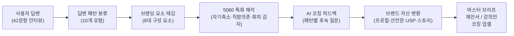
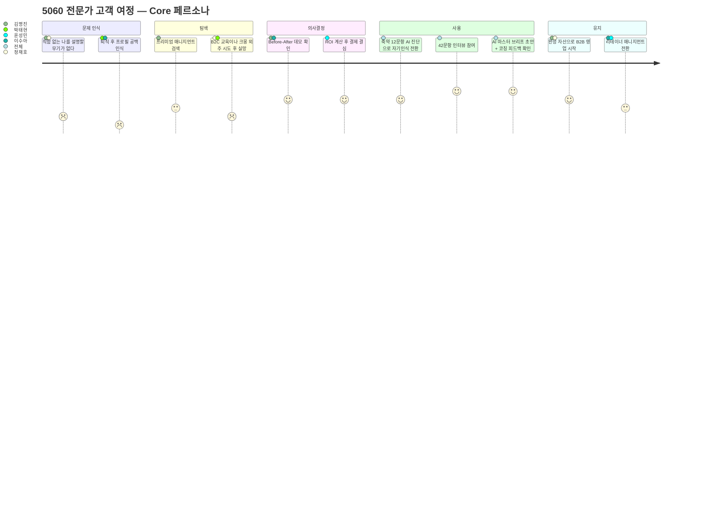
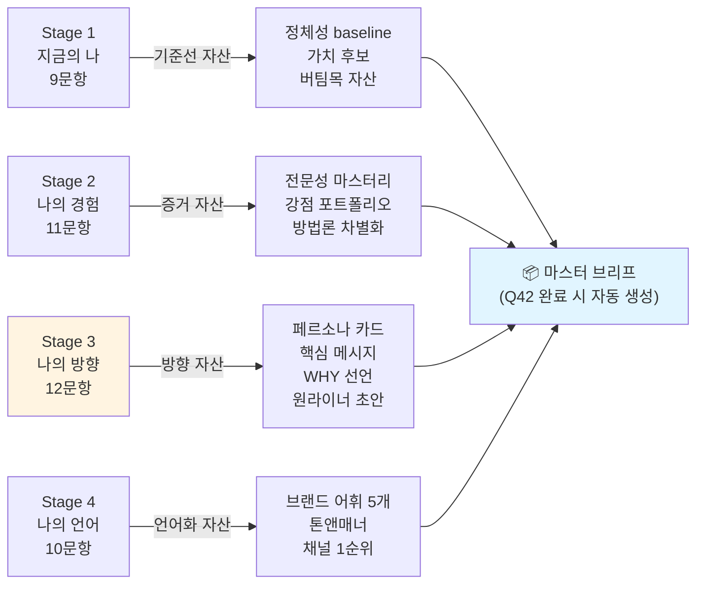
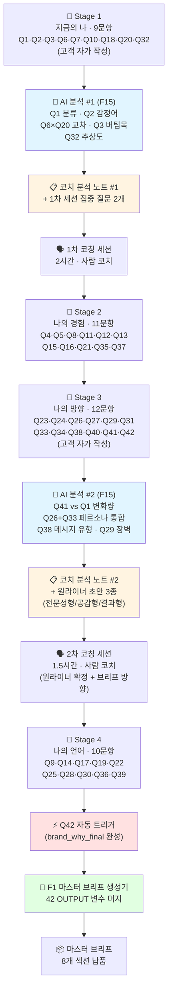
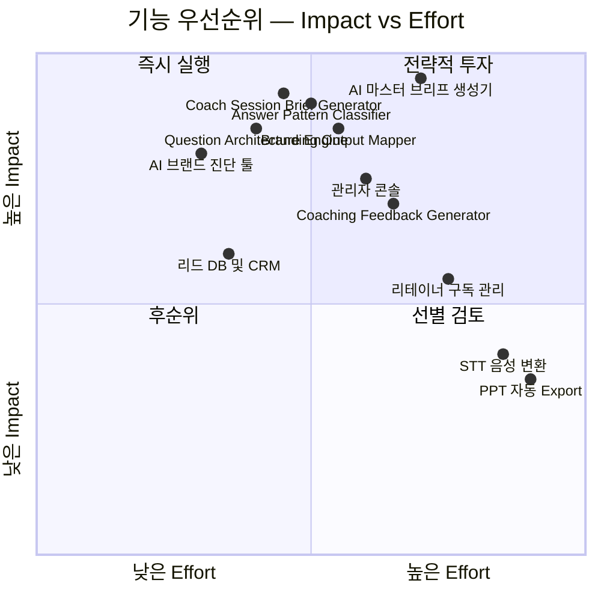
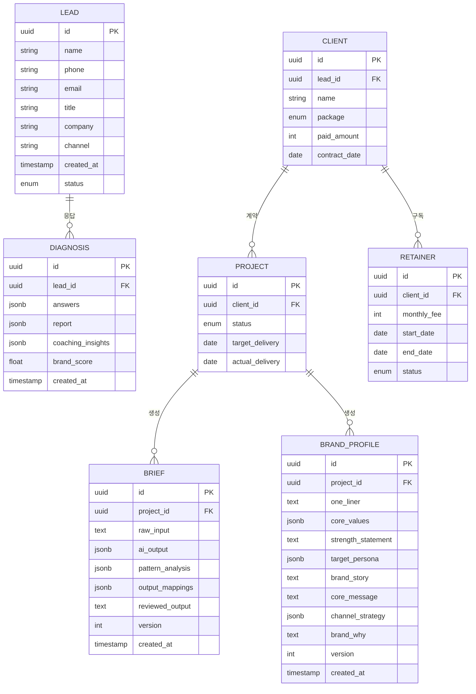

# 5060 프리미엄 브랜드 매니지먼트 PRD v0.4.2

| 항목 | 내용 |
| :--- | :--- |
| **Owner 팀** | 브랜드 매니지먼트 사업부 (대표 1인 + AI Ops) |
| **최종 업데이트** | 2026-04-25 |
| **문서 버전** | v0.4.2 — AI 처리 로직 스펙 통합본 |
| **이전 버전** | [v0.4.1 — 코치 운영 자동화 분리본](./PRD_v0_4_1.md) / [v0.4](./PRD_v0_4.md) / [v0.3](./PRD_v0_3.md) |
| **변경 이력** | **(v0.4.2)** AI 개발용 코칭 가이드 완전판 통합 — §5-4 신설(42문항 의사 코드 AI 처리 로직 스펙, System Prompt 직접 적용 가능 형태), §10-3 신설(42 OUTPUT 변수 데이터 스키마), §4-2 보강(Stage 1·2·3·4 4단계 답변 그룹 구조 명시: 9+11+12+10=42), §7-0-2 수정(Stage 1~4 답변 그룹 + 코칭 세션 흐름 통합 매핑), §5-3 정정(168 vs 126 패턴 스크립트 출처 정합 — 4패턴 가이드 vs 3패턴 가이드 통합 구조 명시), F1 트리거 보강(Q42 완료 시 자동 실행), F15 의사 코드 기반 명시, AC-Logic 신규 AC군 신설(7-10), 교차 검증 매트릭스 명시(§5-5 신설), 13-2 실험 E11 신설(AI 로직 OUTPUT 변수 정확도)<br>**(v0.4.1)** F15 Coach Session Brief Generator 신규 기능 신설, F1에서 코치 분석 노트 책임 분리, E9·E10 실험 신설, PF-6·PF-7 매핑 추가<br>**(v0.4)** 7장 사용자 스토리·AC를 코칭 가이드 4단계 흐름 기반으로 재구성, US-1~US-7 신설, AC-Sess·AC-One·AC-Cross AC군 신설<br>**(v0.3)** 42문항 코칭 프레임워크 통합, 답변 패턴 분류 체계 신설, 브랜딩 아웃풋 맵 추가, F9~F14 신규 기능 |
| **근거 문서** | [PRD v0.2](../../PRD-From-VPS-Sample/03_PRD-Drafts/PRD__v1.0.md) / **[나다운 브랜딩 5060 AI 개발용 코칭 가이드 완전판](../../자료/coaching_guide_full.docx)** — 의사 코드 AI 처리 로직 + 42 OUTPUT 변수 + Stage 4단계 구조 출처 / [나다운 브랜딩 5060 코칭 가이드 42문항](../../자료/나다운_브랜딩_5060_코칭_가이드_42문항.md) — 168 패턴 코칭 스크립트 출처(코치용 풀 버전) / [나다운 브랜딩 5060 코칭 실전 완전 가이드](../../자료/nadaun_branding_5060_coaching_guide.md) — 코칭 흐름 운영 가이드 출처 |
| **상태** | 🟡 Draft — 이해관계자 리뷰 대기 |

---

## 1. 개요·목표

### 1-1. 문제 정의 (Pain 지표 포함)

5060 고경력 전문가(퇴직·전환기 임원, 연구원, 전문직)는 풍부한 암묵지를 보유하고 있으나, 이를 시장이 구매 가능한 B2B 자산(제안서·강의안)으로 변환하지 못해 **수익 기회를 상실**하고 있다.

| # | Pain | 실패 KPI (현재 기준선) | 수치 근거 |
| :---: | :--- | :--- | :--- |
| P1 | **경력 언어화 실패** — 직함은 있으나 ROI 기반 가치 제안 문장이 없음 | B2B 제안서 완성률 ≤ **5%** (3개월 내 1건도 완성하지 못하는 비율 95%) | JTBD 인터뷰: *"석 달째 빈 화면만 켜놓고 한 줄도 못 썼어요."* |
| P2 | **자산 분산·신뢰 저하** — 프로필·제안서·SNS가 파편화 | B2B 플랫폼 프로필 조회수 **0건/월**, 컨택 전환율 **0%** | JTBD 인터뷰: *"플랫폼에 가입은 했는데 조회수가 0입니다."* |
| P3 | **실행 진입 장벽(체면·디지털 피로)** — PPT 등 디지털 도구 조작 거부 | 서비스 자체 진행 시도율 **< 10%**, 외주 만족도 **2.0/5.0** | JTBD 인터뷰: *"크몽 외주 줘봤자 속 빈 강정."* |
| P4 | **기존 대안의 구조적 한계** — 전직 지원·코칭·매칭 플랫폼 이탈 | 기존 서비스 이용 후 B2B 수주 성공률 **< 3%**, 재구매율 **< 15%** | 경쟁사 20+社 분석 결과 |
| P5 | **직함 의존 정체성** — 직함·직위가 제거되면 자기를 설명할 언어 자체가 없음 | 자기소개 시 직함 의존 비율 **≥ 85%**, 가치 기반 소개 가능 비율 **< 10%** | 코칭 가이드 Q1 패턴 분석: *"직함 없이 자신을 소개한 경험 자체가 드물다"* |
| P6 | **강점·가치·스토리의 비구조화** — 경험은 풍부하나 브랜드 자산으로 구조화되지 않음 | 핵심 가치 3가지 즉시 열거 가능 비율 **< 20%**, 브랜드 원라이너 보유율 **< 5%** | 코칭 가이드 Q20·Q41 패턴: *"경력자일수록 한 문장으로 자신을 표현하는 것을 어려워한다"* |
| P7 | **자기축소 및 실패 노출 회피** — 성취를 과소평가하고 실패 경험 공유를 거부 | 자기축소형 답변 비율 **≥ 60%**, 실패 서사 공유 거부율 **≥ 40%** | 코칭 가이드 Q2·Q15 패턴: *"자랑스럽다는 감정을 쉽게 축소하는 경향"* |

### 1-2. 목표 (Desired Outcome 수치화)

> **Product Vision:** 5060 전문가의 축적된 경험을 **42문항 구조화 인터뷰 기반으로 진단**하고, **답변 패턴을 해석**한 뒤, **브랜드 프로필·B2B 제안서·강의안으로 변환**하는 AI 기반 코칭 시스템이다. 단순히 인터뷰 내용을 제안서로 바꾸는 서비스가 아니라, 정체성·가치·강점·스토리·타깃·메시지·채널·임팩트를 **구조적으로 진단하고 코칭하여 브랜드 자산으로 변환하는 Done-for-you 프리미엄 매니지먼트 시스템**을 구축한다.

### 1-3. 성공 지표 (북극성 KPI / 보조 KPI)

> *기존 v0.2 KPI 표 전체 유지 (변경 없음)*

| 구분 | KPI | 기준선 | 목표값 | 측정 주기 | 측정 경로 |
| :---: | :--- | :--- | :--- | :--- | :--- |
| **⭐ 북극성** | **고객 1인당 B2B 수주 건수** | 0건 | **≥ 2건** | 분기 | Supabase `projects.outcome_count` |
| 보조 1 | 마스터 브리프 초안 생성 소요시간 | 48시간 | **≤ 30분** | 건별 | `briefs.created_at` 타임스탬프 |
| 보조 2 | Option B(880만 원) 전환율 | N/A | **≥ 10%** | 월간 | Supabase 조인 쿼리 |
| 보조 3 | 고객 만족도(NPS) | N/A | **≥ 70** | 프로젝트 종료 시 | Typeform NPS 설문 |
| 보조 4 | 리테이너 전환율 | N/A | **≥ 30%** | 분기 | Supabase `retainers` |
| 보조 5 | AI 진단 리포트 완독 → CTA 클릭율 | N/A | **≥ 10%** | 주간 | GA4 이벤트 |
| 보조 6 | 월간 신규 진단 리드 수 | 0명 | **≥ 50명** | 월간 | Supabase `leads` |

### 1-4. 핵심 작동 구조 *(NEW)*



> **핵심 원리:** 사용자의 답변은 단순 텍스트가 아니라, 8개 브랜딩 구성 요소(정체성·핵심 가치·강점·스토리·이상적 고객·핵심 메시지·채널 전략·레거시)에 매핑되는 **브랜드 원재료**이다. AI는 이 원재료에서 패턴을 읽고, 5060 특화 인사이트를 적용하여 코칭 피드백을 생성하며, 최종적으로 구조화된 브랜드 자산으로 변환한다.
>
> **시간축 작동 흐름**(Stage 1 → 1차 세션 → Stage 3 → 2차 세션)에 따라 위 작동이 단계적으로 누적·정제되는 구조는 **§7-0-2 4단계 코칭 흐름** 참조.

---

## 2. 사용자와 페르소나

### 2-1. 핵심 페르소나 요약

> **AOS-DOS 기회점수 사분면** 기반으로 Q1(High AOS / High DOS) 5인을 최우선 공략 타깃으로 설정한다.

| Tier | 페르소나 | 핵심 Pain | AOS | DOS | 서비스 핏 |
| :---: | :--- | :--- | :---: | :---: | :--- |
| **🔥 Core** | **김명진 (55)** 前 대기업 전략기획 임원 | 직함 대체용 B2B 제안서 변환 방법 부재 | 4.00 | 3.60 | 압도적 폭발력. 최우선 공략 |
| **🔥 Core** | **정재호 (59)** 1금융권 영업본부장 | 아날로그 자산 → 디지털 설계 파트너 부재 | 3.60 | 2.80 | Done-for-you 전통 관리직 |
| **🔥 Core** | **박태현 (58)** 국책연구소 수석연구원 | 딥테크 지식 → B2B 언어 번역 불가 | 2.70 | 1.75 | R&D/전문직 병목 해소 |
| **💎 Core** | **이수아 (52)** 외국계 HR 총괄 임원 | 경험 → 기업교육 패키지 구조화 한계 | 2.40 | 1.60 | HR/코칭/강연 확산성 |
| **💎 Adj** | **윤성민 (48)** B2B SaaS 스타트업 대표 | 오너 PR·강의안 기획 시간 절대 부족 | 2.25 | 1.60 | 법인 예산 활용 가능 |

### 2-2. 페르소나별 코칭 프로필 *(NEW)*

| 페르소나 | 브랜딩 장애 유형 | 예상 답변 패턴 | 필요한 코칭 방식 | 최종 변환 자산 |
| :--- | :--- | :--- | :--- | :--- |
| **김명진** 前 임원 | 직함 의존 정체성, ROI 언어 부족, 성과 중심 서사 | Q1: 직함·역할만 말함 / Q2: 외적 성과만 나열 / Q13: 암묵지 상태("그냥 한다") | 직함 제거 후 의사결정 원칙과 전략 방법론 추출. Q6 의사결정 기준에서 브랜드 철학 도출. Q13에서 암묵지를 명시적 방법론으로 언어화 | C-Level 전략 제안서, 고문 자문 프로필, 전략 방법론 강의안 |
| **정재호** 영업본부장 | 디지털 피로, 구술형 사고, 자기표현 부담 | Q1: 타인 시각으로 말함 / Q4: 직업·전공 영역 중심 / Q28: 디지털 거부감 | 구술 내용을 구조화된 B2B 메시지로 변환. 오프라인 강연을 1순위 채널로 설계. 타이핑 0% 원칙 적용 | 영업 리더십 강의안, 자문 제안서, 오프라인 강연 프로필 |
| **박태현** 수석연구원 | 전문용어 의존, 시장 언어 번역 불가, 타깃 과확장 | Q9: "모든 사람" 타깃 / Q34: 자신 역량 중심 / Q35: 차별점 인식 부족 | 딥테크 지식을 비전문가 언어로 번역. Q33에서 타깃 좁히기. Q35에서 경험 기반 차별화 도출 | 기술 자문 제안서, R&D 리더십 강의안, 기술 브리핑 템플릿 |
| **이수아** HR 총괄 | 경험 나열형, 체계화 미흡, 가치 중심 사고 가능 | Q2: 타인을 도운 순간 / Q11: 태도·성향 중심 / Q26: 구체적 사람 묘사 | HR 경험을 기업교육 커리큘럼으로 구조화. Q13에서 HR 방법론 명시화. 코칭·강연 브랜드로 포지셔닝 | 기업교육 패키지, HR 코칭 프로그램, 리더십 강의안 |
| **윤성민** 대표 | 시간 부족, 자기 객관화 미완, 법인 비용 활용 | Q24: 현재 직업의 연장 / Q21: 너무 길고 복잡 / Q38: 여러 메시지 나열 | 핵심 선택 압축 훈련. Q41에서 7개 단어 이하 원라이너 도출. 법인 결제 구조에 맞춘 패키지 설계 | 오너 PR 프로필, 시그니처 강연 1종, 법인 브랜딩 에셋 |

### 2-3. 고객 여정 Pain·Needs 맵




## 3. Coaching Framework *(NEW — 챕터 A)*

### 3-1. 제품의 핵심 코칭 철학

이 제품은 5060 고경력 전문가를 대상으로 한다. 10~20년 이상 자기 분야를 해온 사람에게 어설픈 공감이나 일반적 조언은 **역효과**를 낳는다. 경력자는 수십 년의 경험으로 형성된 자기 기준이 있다.

| 원칙 | 설명 | 금지 사항 |
| :--- | :--- | :--- |
| **경력 존중** | 사용자의 경험 자체를 브랜드 원재료로 존중한다 | ❌ "이렇게 해보세요" 식 일반 조언 |
| **패턴 기반 해석** | 답변의 내용이 아니라 답변의 **방식**에서 브랜딩 단서를 읽는다 | ❌ 답변을 액면 그대로 수용 |
| **자산 변환 지향** | 모든 코칭은 최종 브랜드 산출물로의 변환을 목표로 한다 | ❌ 탐색만 하고 변환하지 않음 |
| **가설 표현** | AI 해석은 항상 "~일 수 있습니다"로 표현한다 | ❌ "당신은 ~입니다"라는 단정 |
| **비구조화 자산 구조화** | 암묵지를 명시적 방법론·선언문·메시지로 언어화한다 | ❌ 추상적 감상에 머무름 |

### 3-2. 5060 사용자에 대한 전제

| 전제 | 코칭 가이드 근거 | 제품 요건 반영 |
| :--- | :--- | :--- |
| 직함 없이 자기를 소개한 경험이 드물다 | Q1 인사이트 | AI 코칭 시 "직함 의존 패턴" 감지 → 자동 후속 질문 |
| 성취를 "당연한 것"으로 축소한다 | Q2·Q7 인사이트 | "자기축소형 답변" 감지 → 재프레이밍 코칭 |
| 실패 노출에 심리적 저항이 크다 | Q15 인사이트 | "실패 회피형 답변" 감지 → 점진적 탐색 유도 |
| "모든 사람"을 돕겠다며 타깃을 좁히지 못한다 | Q9·Q26 인사이트 | "타깃 과확장형 답변" 감지 → 좁히기 코칭 |
| 디지털 도구에 피로와 거부감이 있다 | Q28·Q40 인사이트 | 타이핑 최소화, 구술 입력, 객관식 비율 증가 |

### 3-3. 답변을 브랜드 자산으로 변환하는 원칙

1. **각 질문은 단독이 아니다.** 파트 전체의 흐름 속에서 누적되어 최종 브랜드 프로필을 완성한다.
2. **답변의 "어디에 쓰이는지"를 항상 보여준다.** 이 답변이 브랜드 프로필의 어떤 섹션에 들어가는지를 명시하면 사용자의 완주 동기가 높아진다.
3. **패턴별 코칭 발언은 실제 사용 가능한 스크립트다.** 코칭 가이드의 168개 패턴 코칭 문장을 AI 프롬프트에 직접 삽입한다.
4. **교차 검증으로 일관성을 확보한다.** Q1(정체성)과 Q21(강점 명제문)과 Q41(원라이너)의 답변 일관성을 교차 분석한다.

---

## 4. Question Architecture *(NEW — 챕터 B)*

### 4-1. 42문항의 구조 — PART 분류 (브랜드 자산 관점)

| 파트 | 제목 | 질문 범위 | 탐색 목적 | 핵심 브랜딩 요소 |
| :---: | :--- | :---: | :--- | :--- |
| **PART 1** | 나는 어떤 삶을 살아왔는가 | Q01~Q10 | 과거 자원 탐색 | 브랜드 정체성, 핵심 가치, 레질리언스, 전문성, 의사결정 원칙, 브랜드 서사, 지혜 포지셔닝 |
| **PART 2** | 나는 지금 무엇을 가지고 있는가 | Q11~Q22 | 강점·자산 발견 | 강점 포트폴리오, 자연 권위 영역, 방법론 차별화, 네트워크 자산, 열정 영역, 가치 명문화, 인식 갭 |
| **PART 3** | 나는 무엇을 원하는가 | Q23~Q32 | 미래 방향 설정 | 비전, 제2챕터 설계, 이상적 고객, 임팩트, 채널 적합성, 실행 장벽, 브랜드 목적 |
| **PART 4** | 나는 세상에 어떻게 말할 것인가 | Q33~Q42 | 브랜드 언어 구성 | 타깃 페르소나, USP, 브랜드 어휘, 스토리 전환점, 핵심 메시지, 톤앤매너, 채널 전략, 원라이너, WHY |

### 4-2. 42문항의 구조 — Stage 분류 (코칭 답변 그룹 관점) *(NEW v0.4.2)*

> **이중 분류 원칙:** 42문항은 "PART 분류"(브랜드 자산 관점, §4-1)와 "Stage 분류"(코칭 답변 그룹 관점)로 동시에 매핑된다. PART는 결과물 구조 설계용, Stage는 답변 단계별 AI 처리 흐름용.
>
> **출처:** 나다운 브랜딩 5060 AI 개발용 코칭 가이드 완전판
> **합계 검증:** 9 + 11 + 12 + 10 = **42문항** ✅

| Stage | 단계명 | 문항 수 | 질문 번호 | 코칭 단계 매핑 |
| :---: | :--- | :---: | :--- | :--- |
| **Stage 1** | 지금의 나 | 9 | Q1, Q2, Q3, Q6, Q7, Q10, Q18, Q20, Q32 | 사전 자가 답변 → 1차 세션 준비 |
| **Stage 2** | 나의 경험 | 11 | Q4, Q5, Q8, Q11, Q12, Q13, Q15, Q16, Q21, Q35, Q37 | 1차 세션 중·후 답변 (전문성·스토리 발굴) |
| **Stage 3** | 나의 방향 | 12 | Q23, Q24, Q26, Q27, Q29, Q31, Q33, Q34, Q38, Q40, Q41, Q42 | 중간 자가 답변 → 2차 세션 준비 |
| **Stage 4** | 나의 언어 | 10 | Q9, Q14, Q17, Q19, Q22, Q25, Q28, Q30, Q36, Q39 | 2차 세션 후 심화 답변 (어휘·채널·톤 확정) |

#### 4-2-1. Stage별 핵심 자산 도출 흐름



> **자동 트리거:** Q42(브랜드 WHY 최종 선언) 답변 완료 시점이 마스터 브리프 자동 생성 트리거다 — 새 가이드 Q42 처리 로직에 명시. F1 트리거 조건 §8-2 참조.

### 4-3. 질문별 브랜딩 요소 매핑

| 브랜드 구성 요소 | 연결 질문 | 최종 아웃풋 |
| :--- | :--- | :--- |
| **브랜드 정체성** | Q1 · Q7 · Q10 · Q21 · Q41 | 브랜드 원라이너, 프로필 소개문 |
| **핵심 가치 체계** | Q2 · Q6 · Q20 · Q32 · Q42 | 가치 선언문, 브랜드 WHY |
| **강점 & 전문성** | Q4 · Q11 · Q12 · Q13 · Q35 | USP, 방법론, 전문성 포지셔닝 |
| **브랜드 스토리** | Q3 · Q8 · Q15 · Q37 | 핵심 에피소드, 강연 오프닝 |
| **이상적 고객** | Q9 · Q26 · Q33 · Q34 | 타깃 페르소나, 메시지 타깃 |
| **핵심 메시지** | Q10 · Q38 · Q41 · Q42 | 브랜드 포지셔닝 스테이트먼트 |
| **채널 전략** | Q17 · Q19 · Q28 · Q40 | 실행 채널, 콘텐츠 형태 |
| **레거시 & 임팩트** | Q27 · Q31 · Q32 | 브랜드 약속, 사회적 임팩트 |

### 4-4. MVP 축약 문항 기준 (12~16문항)

MVP AI 진단에서는 42문항 전체가 아닌 핵심 문항만으로 축약 진단을 실시한다.

| 축약 기준 | 선정 질문 | 이유 |
| :--- | :--- | :--- |
| **정체성 진단** | Q1, Q7 | 직함 의존 vs 가치 기반 정체성 즉시 파악 |
| **핵심 가치** | Q2, Q6 | 자랑스러운 순간 + 의사결정 기준 = 가치관 교차 추출 |
| **강점 추출** | Q4, Q11, Q13 | 전문성 깊이 + 강점 포트폴리오 + 방법론 차별화 |
| **스토리** | Q8, Q15 | 핵심 서사 + 실패 통합 여부 |
| **타깃 & 메시지** | Q9, Q26, Q33 | 에너지 관계 → 이상적 고객 → 타깃 페르소나 |
| **채널 & 비전** | Q28, Q40 | 채널 적합성 + 채널 전략 |
| **통합 & WHY** | Q41, Q42 | 브랜드 원라이너 + 궁극적 목적 |

**총 16문항:** Q1, Q2, Q4, Q6, Q7, Q8, Q9, Q11, Q13, Q15, Q26, Q28, Q33, Q40, Q41, Q42

### 4-5. 질문 순서 설계 원칙

1. **과거 → 현재 → 미래 → 언어화** 순서를 유지한다 (PART 1→2→3→4)
2. 안전한 질문(Q1 자기소개)에서 시작하여 민감한 질문(Q15 실패, Q31 두려움)으로 점진적 심화
3. 각 파트의 마지막 질문은 해당 파트의 통합 질문(Q10, Q21, Q32, Q42)으로 구성
4. MVP 축약 진단에서도 이 순서를 유지하되, 각 파트에서 핵심 문항만 선별

---

## 5. Answer Pattern Taxonomy *(NEW — 챕터 C)*

### 5-1. 답변 패턴 분류 체계

| # | 패턴명 | 신호 | 리스크 | AI 코칭 방향 | 후속 질문 예시 | 연결 산출물 |
| :---: | :--- | :--- | :--- | :--- | :--- | :--- |
| P1 | **직함 중심형** | "前 OO팀장", "OO대표" 등 직함·직위로만 자기 정의 | 직함 제거 시 정체성 공백 | 직함 없이 남는 가치·태도·방식 탐색 | *"직함이 사라져도 남는 당신을 찾아봅시다"* | 브랜드 원라이너, 프로필 소개문 |
| P2 | **가치 중심형** | 가치관·태도·신념으로 자기 표현 | 추상적 표현에 머물 위험 | 가치를 구체적 행동·사례와 연결 | *"그 가치가 가장 강하게 발휘된 순간은?"* | 가치 선언문, 브랜드 WHY |
| P3 | **자기축소형** | "별로 없다", "당연한 거 아닌가요", 성취 과소평가 | 브랜드 자산 인식 실패 | 축소된 성취를 재프레이밍하여 가치 재인식 | *"거창하지 않아도 됩니다. 아주 작은 것부터 찾아봐요"* | 강점 명제문, USP |
| P4 | **회피형** | "잘 모르겠다", 실패 인정 회피, 답변 최소화 | 핵심 자산 미발굴 | 안전한 대안 질문으로 점진적 탐색 | *"완전한 실패가 아니어도 됩니다. 좀 더 일찍 알았더라면 좋았을 것이 있다면?"* | 브랜드 스토리 (레질리언스) |
| P5 | **모든 사람 타깃형** | "모든 사람에게 도움", 타깃 미설정 | 메시지 희석, 포지셔닝 실패 | 경험이 가장 빛나는 특정 상황·사람으로 좁히기 | *"당신의 20년 경험이 가장 빛나는 사람이 누구인지 집어봅시다"* | 타깃 페르소나, 메시지 타깃 |
| P6 | **경험 나열형** | 시간순 또는 항목별 경험 나열, 구조화 없음 | 핵심 메시지 미도출 | 공통 패턴 추출 → 하나의 통합 메시지로 압축 | *"나열하신 것들의 공통분모가 뭔가요?"* | 핵심 메시지, 포지셔닝 |
| P7 | **방법론 보유형** | 구체적 방법·프로세스를 설명, 체계적 사고 | 이름 붙이기·구조화 미완 | 방법론에 이름 부여 → 교육·컨설팅 브랜드 연결 | *"그 방법에 이름을 붙인다면 뭐라고 부르겠어요?"* | USP, 방법론, 강의안 목차 |
| P8 | **채널 과욕형** | "유튜브도, 블로그도, 강연도 다 하겠다" | 번아웃, 실행력 분산 | 하나의 1순위 채널 선택 → 나머지는 보조 | *"지금 당장 하나만 깊이 한다면 무엇인가요?"* | 채널 전략, 콘텐츠 형태 |
| P9 | **실패 통합형** | 실패를 성장 자원으로 재해석 완료 | (리스크 낮음) | 실패 서사를 브랜드 신뢰 자산으로 즉시 활용 | *"그 성장을 다른 사람들이 10년 단축할 수 있도록 도와줄 수 있다면?"* | 브랜드 스토리, 강연 오프닝 |
| P10 | **실패 회피형** | 실패 언급 거부, 외부 귀인, 자기 보호 상태 | 브랜드 진정성 부족 | 신뢰 환경 조성 후 점진적 탐색 유도 | *"그 상황에서 당신이 선택할 수 있었던 것은 무엇이었나요?"* | (사람 코치 핸드오프 트리거) |

### 5-2. 패턴 감지 규칙 (AI Classifier 기준)

| 감지 대상 | 감지 신호 (NLP 기준) | 리스크 레벨 | 자동 조치 |
| :--- | :--- | :---: | :--- |
| 직함 의존 | 답변 내 "팀장/부장/대표/이사/원장" 등 직위 명사 2회 이상 + 가치·태도 형용사 0개 | 중 | 후속 질문 자동 생성 |
| 자기축소 | "별로", "당연한", "대단한 건 아니", "그냥" 등 축소 표현 3회 이상 | 중 | 재프레이밍 코칭 메시지 삽입 |
| 타깃 과확장 | "모든", "누구나", "다양한 사람" 등 범용 표현 + 구체적 페르소나 정보 0개 | 높 | 좁히기 코칭 + 보완 질문 |
| 실패 회피 | Q15 답변 길이 < 50자 또는 "없다"/"모르겠다" 포함 | 높 | 대안 질문 제공 + 검수자 플래그 |
| 답변 부족 | 전체 답변 문항 < 20개 또는 평균 답변 길이 < 100자 | 높 | 마스터 브리프 생성 차단 |

### 5-3. 패턴 코칭 스크립트 — Prompt Engineering 원천 *(보강 v0.4.2)*

> **두 가지 출처 가이드의 정합 구조** — v0.4.2에서 정정.
>
> 두 개의 코칭 가이드가 존재하며, 각각의 역할이 다르다.

| 가이드 | 패턴 수 | 1문항당 패턴 | 사용 목적 | 시스템 활용 위치 |
| :--- | :---: | :---: | :--- | :--- |
| **나다운 브랜딩 5060 코칭 가이드 42문항** (코치용 풀 버전) | **168** | 4개 | 사람 코치의 세션 진행 매뉴얼. 폭넓은 답변 패턴 대응. | F10 Answer Pattern Classifier 학습 데이터 / F12 코칭 피드백 생성 / F15 코치 분석 노트 후속 질문 추천 풀 |
| **나다운 브랜딩 5060 AI 개발용 코칭 가이드 완전판** (AI 시스템용 정본) | **126** | 3개 | AI System Prompt에 직접 탑재. 가장 빈도 높은 패턴 3개로 압축한 정본. | F1·F10·F12·F15 모두의 **System Prompt 정본** |

> **핵심:** v0.4.1에서는 "168 패턴"으로 통일되어 있었으나, 실제 AI 시스템 탑재용 정본은 **126 패턴(AI 개발용 완전판)** 이다. 168 패턴 가이드는 코치 학습용 확장 풀로 사용한다. **시스템 코드 단계에서는 126이 기준**이며, F10 Classifier가 답변 패턴을 분류한 후 168 풀에서 추가 코칭 스크립트를 검색·인용하는 2단 구조를 채택한다.

#### 5-3-1. 카드 구조 비교

| 구성 요소 | 코치용 풀 버전 (168) | AI 개발용 정본 (126) |
| :--- | :--- | :--- |
| 질문 의도 | 🔍 (있음) | 💡 (있음) |
| 5060 인사이트 | ⚡ (있음) | ⚡ (있음) |
| 답변 패턴 | 4개 + 신호 해석 + 코칭 스크립트 | 3개 + 신호 해석 + AI 후속 반응 |
| 브랜드 자산 | 🔗 브랜드 프로필 연결 | 🎯 자산 (변수명 명시) |
| **AI 처리 로직** | ❌ 없음 | ✅ **🤖 AI 로직** (의사 코드) |

→ **AI 개발용 완전판이 시스템 구현의 정본**이며, 의사 코드 형태의 AI 로직이 추가로 명시되어 있다는 점이 결정적 차이.

#### 5-3-2. AI 학습 활용 방식

| 활용 방식 | 출처 | 구현 위치 |
| :--- | :--- | :--- |
| Few-shot 예시 (패턴 신호 → 분류 라벨) | 126 정본의 패턴 → 신호 해석 | F10 Classifier System Prompt |
| Prompt 템플릿 (분류 결과 → 코칭 스크립트 인용) | 126 정본의 AI 후속 반응 | F12 Feedback Generator System Prompt |
| 의사 코드 직접 적용 (EXTRACT/CLASSIFY/CROSS-CHECK/OUTPUT) | 126 정본의 🤖 AI 로직 | F1·F15의 처리 함수 설계 직접 인용 |
| 확장 패턴 풀 (3개 패턴으로 분류 안 되는 경계 케이스) | 168 풀 버전의 4번째 패턴 | F10 Classifier 보조 후보 검색 |
| Fine-tuning 후보 | 검수 통과 200건 누적 시 | V2 검토 |

> **§5-1의 P1~P10 패턴 분류**는 두 가이드의 **패턴 메타-카테고리**다. 즉 P1(직함 중심형)은 Q1·Q4·Q24·Q41 등 정체성 계열 질문에서 반복적으로 나타나는 답변 양상의 추상 라벨이며, 실제 코칭 발언은 126/168 스크립트에서 질문별로 직접 인용한다.

> **저작권/IP 처리:** 자체 IP. AI 응답에 인용 시 "출처: 꿈몰다 코칭 가이드" 풋노트 자동 삽입(고객 노출 시).

---

### 5-4. AI 처리 로직 스펙 — 의사 코드 표준 *(NEW v0.4.2 — 핵심 신설)*

> **출처:** 나다운 브랜딩 5060 AI 개발용 코칭 가이드 완전판. 각 질문 카드의 🤖 AI 로직 항목.
> **목적:** Claude API System Prompt에 직접 이식 가능한 의사 코드 표준. 프롬프트 엔지니어가 자유 해석 없이 그대로 구현할 수 있는 명세.
> **적용 기능:** F1 마스터 브리프 생성기 / F10 답변 패턴 분류기 / F12 코칭 피드백 생성기 / F15 코치 세션 브리프 생성기

#### 5-4-1. 표준 의사 코드 동사

42문항 모든 AI 로직은 다음 5개 표준 동사 조합으로 구성된다.

| 동사 | 기능 | 출력 타입 |
| :--- | :--- | :--- |
| **EXTRACT** | 답변 텍스트에서 키워드·감정어·구조를 추출 | string[] / object |
| **CLASSIFY** | 추출된 데이터를 사전 정의 유형 집합으로 분류 | enum |
| **CROSS-CHECK** | 다른 질문의 OUTPUT과 교차 검증 (정합성 점수 산출) | float (0~1) |
| **IF / THEN** | 분류 결과에 따른 분기 처리 (태그 부여 또는 보완 질문 트리거) | side-effect |
| **OUTPUT** | 표준 변수명으로 결과 저장 (§10-3 데이터 스키마 참조) | object |

#### 5-4-2. 의사 코드 예시 — Q1 정체성 baseline

```
// Q1 처리 로직
IF 답변이 직함/회사/직업 중심 → 태그: IDENTITY_EXTERNAL
IF 답변에 가치어(성실,정직,성장 등) 포함 → 태그: IDENTITY_VALUES
IF 답변이 짧거나 "모르겠다" → 태그: IDENTITY_SEARCHING
EXTRACT: 답변에서 명사·형용사 추출 → candidate_identity_words[]
OUTPUT: identity_baseline = {태그, 주요 단어 3개, 다음 질문 난이도 조정값}
```

#### 5-4-3. 의사 코드 예시 — Q20 가치 명문화 (CROSS-CHECK 활용)

```
// Q20 처리 로직
EXTRACT: 나열된 가치어 → stated_values[]
CROSS-CHECK: Q2 감정어 + Q6 선택기준과 교차 검증
IF 교차 일치 → confirmed_value = HIGH
IF 불일치 → flag: 재탐색 필요
OUTPUT: brand_values_confirmed[] = 행동 증거 포함 3개
```

#### 5-4-4. 의사 코드 예시 — Q41 원라이너 3종 생성 (Q1 비교 + 생성)

```
// Q41 처리 로직
COMPARE: Q1 기준선 답변과 현재 답변
MEASURE: 정체성 언어의 심화 정도
GENERATE: 원라이너 후보 3종 [전문성형/공감형/결과형]
OUTPUT: oneliner_draft_v1[] + Q1 변화 요약
```

#### 5-4-5. 의사 코드 예시 — Q42 마스터 브리프 자동 트리거 (시스템 종료 트리거)

```
// Q42 처리 로직
EXTRACT: WHY 유형 → [의미형/자유형/수익형/인정형]
MERGE: Q32(레거시) + Q31(핵심드라이버) + Q42
OUTPUT: brand_why_final = "나는 ___를 위해 이 일을 한다"
// 전체 마스터 브리프 생성 트리거 — Q42 완료 시 자동 실행
```

> **자동 트리거 핵심:** Q42는 단순 마지막 질문이 아니라 **F1 마스터 브리프 생성기를 자동 호출하는 시스템 트리거**다. 이는 §8-2 F1 트리거 조건에 명시된다.

#### 5-4-6. 42문항 의사 코드 적용 분류

42문항을 의사 코드 패턴으로 재분류하면 다음과 같다 (개발 시 우선순위 산정 기준).

| 패턴 유형 | 문항 | 구현 복잡도 | 비고 |
| :--- | :--- | :---: | :--- |
| **EXTRACT 단순형** | Q1, Q3, Q4, Q7, Q12, Q14, Q19, Q23, Q25, Q28, Q30, Q31, Q34, Q36, Q39 | 낮 | 키워드/유형 추출 + OUTPUT 저장 |
| **EXTRACT + CLASSIFY** | Q2, Q8, Q10, Q13, Q15, Q24, Q26, Q27, Q29, Q32, Q33, Q35, Q37, Q38, Q40 | 중 | 추출 후 사전 정의 유형 집합으로 분류 |
| **CROSS-CHECK 핵심** | Q5(↔Q11), Q6(↔Q20), Q11(↔Q5), Q16(↔Q4), Q17(↔Q19,Q40), Q18(↔Q6), Q20(↔Q2,Q6), Q22(↔Q1) | 높 | 다른 질문 OUTPUT과 교차 검증 필수 |
| **MERGE / GENERATE** | Q9(merge Q26+Q33), Q21, Q41(generate 3종), Q42(merge Q31+Q32) | 높 | 여러 질문 결과 통합 또는 신규 생성 |
| **시스템 트리거** | Q42 | 최고 | F1 마스터 브리프 자동 호출 |

---

### 5-5. 교차 검증 매트릭스 *(NEW v0.4.2)*

> **출처:** AI 개발용 완전판의 CROSS-CHECK 지시문을 모두 추출하여 매트릭스로 구조화. F1·F10·F12 구현 시 정합성 검증 로직의 직접 명세.

| 검증 영역 | 교차 질문 조합 | 검증 항목 | 불일치 시 처리 |
| :--- | :--- | :--- | :--- |
| **가치 일관성** | Q2 + Q6 + Q20 (3중 교차) | 자랑스러운 순간(감정어) ↔ 의사결정 기준 ↔ 선언 가치 3개의 키워드 일치도 | 일치도 < 0.5 → flag: 가치 재탐색, 사람 코치 핸드오프 권장 |
| **정체성 진화** | Q1 + Q21 + Q41 (Stage 1·2·3 진화) | 자기 정의 언어의 변화량(직함 의존 비율, 가치어 추가, 어휘 구체성) | 변화량 < 20% → flag: 코칭 효과 미달 |
| **스토리 일관성** | Q3 + Q8 + Q15 + Q37 | 위기 시기·핵심 에피소드·실패 서사·전환점이 같은 시기 또는 구조적으로 연결 | 전환점 시기 불일치 → flag: 코치에게 명확화 요청 |
| **페르소나 정합** | Q26(심리) + Q33(인구) + Q9(에너지) | 마음 상태 + 나이/직업/상황 + 에너지 관계 특성의 정합성 | 상충 → flag: 페르소나 통합 재시도 |
| **전문성 vs 자연 권위** | Q4 + Q12 | 공식 전문 영역과 사람들이 도움 구하는 분야의 일치도 | 불일치 큼 → tag: 숨겨진 전문성 발굴 기회 |
| **외부/내부 강점** | Q5(외부 피드백) + Q11(자가 인식) | 타인 인식 강점과 본인 인식 강점의 갭 | 갭 큼 → output: perception_gap_score 저장 |
| **인식 갭** | Q1 + Q22 | 자기 정의 vs 타인 추정의 단어 일치도 | 갭 큼 → tag: 커뮤니케이션 전략 보정 필요 |
| **WHY 통합** | Q31 + Q32 + Q42 | 핵심 드라이버 + 레거시 + 궁극 목적의 추상도·방향 일관성 | 방향 분산 → flag: WHY 재확인 |
| **채널 적합성** | Q17 + Q19 + Q28 + Q40 | 몰입 조건·표현 환경·기여 방식·채널 선호의 정합성 | 불일치 → output: 채널 추천 재산정 |

> **구현 노트:** 위 9개 매트릭스는 F1 마스터 브리프 생성 전에 모두 통과해야 하는 **검증 게이트**다. 1개 이상 fail 시 §11 사람 코치 핸드오프가 자동 권장된다.

---

## 6. Branding Output Map *(NEW — 챕터 D)*

### 6-1. 브랜딩 요소 → 최종 산출물 매핑

| 브랜딩 요소 | 원천 질문 | 중간 산출물 | 최종 산출물 | 사용처 |
| :--- | :--- | :--- | :--- | :--- |
| **브랜드 정체성** | Q1·Q7·Q10·Q21·Q41 | 정체성 초안 문장 | 브랜드 원라이너, 프로필 소개문 | 명함, SNS 바이오, 플랫폼 프로필 |
| **핵심 가치 체계** | Q2·Q6·Q20·Q32·Q42 | 가치 키워드 3개 | 가치 선언문, 브랜드 WHY | 제안서 서문, 강의 오프닝 |
| **강점 & 전문성** | Q4·Q11·Q12·Q13·Q35 | 강점 클러스터, 방법론 이름 | USP 문장, 방법론 프레임워크, 전문성 포지셔닝 | 제안서 핵심 섹션, 강의안 커리큘럼 |
| **브랜드 스토리** | Q3·Q8·Q15·Q37 | Before-Turning-After 구조 | 핵심 에피소드 1종, 강연 오프닝 스크립트 | 강연 도입, 책 서문, 인터뷰 답변 |
| **이상적 고객** | Q9·Q26·Q33·Q34 | 인구통계 + 심리통계 프로필 | 타깃 페르소나 카드, 메시지 타깃 정의 | 마케팅 카피, 콘텐츠 기획 |
| **핵심 메시지** | Q10·Q38·Q41·Q42 | 메시지 후보 3종 | 포지셔닝 스테이트먼트 1종 | 모든 채널 일관 적용 |
| **채널 전략** | Q17·Q19·Q28·Q40 | 채널 적합도 매트릭스 | 1순위 채널 + 보조 채널 2종 | 실행 로드맵 |
| **레거시 & 임팩트** | Q27·Q31·Q32 | 임팩트 정의문 | 브랜드 약속, 사회적 임팩트 선언 | 제안서 비전 섹션, 강의 클로징 |

### 6-2. 브랜드 프로필 완성 체크리스트

42문항 코칭 완료 후 다음 8개 섹션이 모두 채워져야 브랜드 프로필이 완성된다:

| # | 프로필 섹션 | 원천 질문 경로 | 완성 기준 |
| :---: | :--- | :--- | :--- |
| 1 | 브랜드 원라이너 | Q1→Q21→Q41 | "나는 [대상]이 [문제]를 해결하도록 [방식]으로 돕는 사람이다" 구조 |
| 2 | 핵심 가치 3가지 | Q2·Q6·Q20 교차 추출 | 3개 가치 키워드 + 각 1개 행동 사례 |
| 3 | 강점 명제문 | Q11·Q12·Q13 통합 | 차별화된 역량 한 문장 |
| 4 | 타깃 페르소나 | Q9·Q26·Q33 통합 | 인구통계 + 심리통계 완성 |
| 5 | 브랜드 스토리 핵심 | Q8·Q15·Q37 선택 | Before-Turning-After 3문장 구조 |
| 6 | 핵심 메시지 | Q10·Q38 도출 | 관점 전환형 메시지 1문장 |
| 7 | 채널 전략 | Q17·Q19·Q28·Q40 종합 | 1순위 채널 + 주간 실행 빈도 |
| 8 | 브랜드 WHY | Q32·Q42 도출 | 궁극적 목적 선언문 1문장 |


## 7. 사용자 스토리와 수용 기준 (AC) — 코칭 가이드 4단계 흐름 통합 *(v0.4 재구성)*

> **재구성 원칙:** 이 제품은 단일 인터뷰 분석 도구가 아니라, **Stage 1(사전 9문항) → 1차 세션 → Stage 3(중간 12문항) → 2차 세션** 4단계 코칭 흐름을 AI가 보조하는 시스템이다. 따라서 7장은 (a) Actor 분리 (b) 단계별 AI 보조 (c) 코치 세션 준비 자동 지원 (d) 원라이너 3종 사전 생성 (e) 단계 간 교차 분석을 모두 다룬다.
>
> *기존 v0.2 Story 1~4의 AC 표는 그대로 유지한다. 아래는 코칭 가이드 통합으로 추가/보강된 AC를 다룬다.*

### 7-0. Actor 정의 및 4단계 코칭 흐름 *(NEW)*

#### 7-0-1. Actor 정의

| Actor | 역할 | 주요 시스템 권한 |
| :--- | :--- | :--- |
| **고객** (5060 전문가) | 4단계 코칭 흐름의 핵심 사용자 | Stage 1·3 질문지 응답, 진단 리포트 조회, 마스터 브리프 검토·승인, CTA 진입 |
| **운영자 / 사람 코치** | 1차·2차 세션 진행, AI 분석 결과 검수, 마스터 브리프 최종 확정 | 관리자 콘솔, AI 분석 노트 검토·승인·거부, 원라이너 초안 수정, 사람 코치 핸드오프 플래그 처리 |
| **AI 분석 엔진** | 답변 패턴 분류, 브랜딩 요소 태깅, 코치 세션 준비 자동 지원, 원라이너 초안 생성 | 분석 노트 자동 생성, 후속 질문 트리거, 패턴 감지, 교차 분석, 환각·이상치 자가 검출 |

#### 7-0-2. 4단계 코칭 흐름과 AI 개입 지점



> **핵심 원리:** AI는 "세션을 대체"하는 것이 아니라 **"세션 사이의 답변 분석과 사전 준비"** 를 자동화하여, 코치의 세션 준비 시간을 60분 → 15분으로 단축하고, 일반론을 방지하며, 답변 변화를 추적한다.
>
> **Stage 구조 핵심:** 4개의 Stage는 **고객 답변 그룹**(9+11+12+10=42)이며, 그 사이에 1차·2차 코칭 세션이 들어간다. Stage 2와 Stage 4는 코칭 세션 직후 답변 단계로서 v0.4.2에서 명시되었다(이전 버전 누락 보정). Q42 답변 완료 시점이 마스터 브리프 자동 생성 트리거다(§5-4-5, §10-3-3).

---

### 7-1. 사용자 스토리 (US) — 4단계 흐름 기반 *(NEW)*

| US# | Actor | 사용자 스토리 | 핵심 가치 | 연결 AC |
| :---: | :--- | :--- | :--- | :--- |
| **US-1** | 고객 | Stage 1·3 질문지 작성 시, 각 질문이 **"어디에 쓰이는지"** (브랜드 자산 매핑)를 미리 안내받고 싶다 | 작성 동기 부여, 완주율 향상 | AC-Suf-1, AC-Map-1 |
| **US-2** | 코치 | 고객의 Stage 1 답변 수신 직후, AI가 자동 생성한 분석 노트(Q1 분류·Q2 감정어·Q6×Q20 교차·집중 질문 2개)를 받아 **1차 세션 준비 시간을 단축**하고 싶다 | 세션 준비 60분 → 15분 | AC-Sess-1, AC-Sess-2 |
| **US-3** | 코치 | 답변에 **5060 특화 신호**(직함 의존·자기축소·실패 회피·타깃 과확장·"당연한 것 아닌가요")가 감지되면, 코칭 가이드의 후속 질문 스크립트를 즉시 사용하고 싶다 | 일반론 코칭 방지, 5060 특화 정확도 | AC-Pat-1~8 |
| **US-4** | 고객 | Stage 3 작성 시, Stage 1과의 **변화점**(예: 직함 의존 70% → 30%)이 시각적으로 표시되어 **자기인식 전환을 체감**하고 싶다 | 진척감, 다음 세션 기대감 | AC-Cross-1, AC-Map-3 |
| **US-5** | 코치 | 2차 세션 24시간 전, AI가 Stage 1+2+3 통합 답변에서 **원라이너 초안 3종**(전문성형/공감형/결과형)을 자동 생성해주면 좋겠다 | 세션 효율 + 고객 체감 만족 | AC-One-1~3 |
| **US-6** | 고객 | 마스터 브리프 납품 시, 8개 섹션이 각각 **어떤 답변에서 도출되었는지 추적 가능**해야 결과물을 신뢰할 수 있다 | 결과물 투명성·신뢰성 | AC-Out-4 |
| **US-7** | 코치 | 답변 간 **일관성 충돌**(Q6 vs Q20 가치 불일치, Q1 vs Q41 정체성 변화 부재 등)이 자동 감지되어 검수에 활용하고 싶다 | 브랜드 일관성, 검수 효율 | AC-Cross-2~3, AC-Out-5 |

---

### 7-2. AC — 답변 충분성

| AC# | Given | When | Then | 측정 임계치 |
| :---: | :--- | :--- | :--- | :--- |
| AC-Suf-1 | 고객이 42문항 중 **20문항 미만** 응답 | 마스터 브리프 생성 요청 | 시스템이 "응답 부족(최소 20문항 필요)" 경고 출력, 생성 차단 | 차단 정확도 **100%** |
| AC-Suf-2 | 고객이 응답한 문항 중 **평균 답변 길이 < 100자** | AI 분석 시작 | 시스템이 "답변 보충 필요" 알림 + 해당 문항 목록 표시 | 부족 문항 식별 정확도 ≥ **95%** |
| AC-Suf-3 | 고객이 특정 질문에 핵심 키워드 0개 추출 가능 상태 | AI가 답변을 분석하면 | 해당 문항에 대한 보완 질문 1~2개를 자동 생성 | 보완 질문 적합도 ≥ **85%** |

---

### 7-3. AC — 답변 패턴 분석 *(코칭 가이드 신호 감지 통합 보강)*

> *코칭 가이드의 "⚡ 신호 감지" 항목을 AC로 직접 매핑한다. AI Classifier는 이 표를 학습 기준으로 사용한다.*

| AC# | Given | When | Then | 측정 임계치 | 코칭 가이드 근거 |
| :---: | :--- | :--- | :--- | :--- | :--- |
| AC-Pat-1 | 고객이 Q1 자기소개에 직함·회사명 중심으로 답변 | AI가 답변 분석 | "직함 의존 정체성"(P1) 패턴 분류 + 후속 질문 *"직함이 사라져도 남는 당신을 찾아봅시다"* 생성 | 분류 정확도 ≥ **85%**, 검수자 동의율 ≥ **80%** | Q1 분석 노트, P1 패턴 |
| AC-Pat-2 | 고객이 Q2/Q7에서 "별로 없다", "당연한 거" 등 축소 표현 ≥ 3회 사용 | AI가 답변 분석 | "자기축소형"(P3) 패턴 분류 + 재프레이밍 메시지 *"거창하지 않아도 됩니다. 아주 작은 것부터 찾아봐요"* 생성 | 자기축소 감지 정밀도 ≥ **80%** | Q2 인사이트, P3 패턴 |
| AC-Pat-3 | 고객이 Q9/Q26에서 "모든 사람", "다양한 분", "누구나" 등 범용 표현 + 구체 페르소나 0개 | AI가 답변 분석 | "타깃 과확장형"(P5) 패턴 분류 + 좁히기 코칭 질문 *"당신의 20년 경험이 가장 빛나는 사람이 누구인지 집어봅시다"* 생성 | 감지 정밀도 ≥ **85%** | Q26 인사이트, P5 패턴 |
| AC-Pat-4 | 고객이 Q15 실패 질문에 50자 미만 OR "없다"/"모르겠다"/"그냥 버텼다" 표현 | AI가 답변 분석 | "실패 회피형"(P10) 패턴 분류 + 대안 질문 *"좀 더 일찍 알았더라면 좋았을 것이 있다면?"* + 검수자에게 **"사람 코치 개입 권장"** 플래그 | 회피 감지 정밀도 ≥ **80%** | Q15 ⚡ 신호, 11-2 핸드오프 |
| **AC-Pat-5** *(NEW)* | 고객이 **Q4(가장 오래 깊이 해온 것)** 답변에 *"당연한 거 아닌가요"* 표현 OR 직업만 나열 | AI가 답변 분석 | "전문성 마스터리 과소평가" 패턴 분류 + 코칭 메시지 *"그게 당연한 사람이 얼마나 될 것 같으세요? 저는 이게 정말 특별한 자산이라고 생각해요"* 생성 | 정밀도 ≥ **80%** | Q4 ⚡ 신호 |
| **AC-Pat-6** *(NEW)* | 고객이 **Q35(차별점)** 답변에 *"모르겠다"* OR 경력 연수("30년 경력")로만 답변 | AI가 답변 분석 | "차별점 인식 부족" 패턴 분류 + 역방향 질문 *"그 분야에서 흔한 방식 중 당신이 가장 동의 안 되는 것이 있나요? 그 반대가 차별점입니다"* 생성 | 정밀도 ≥ **80%** | Q35 ⚡ 신호 |
| **AC-Pat-7** *(NEW)* | 고객이 **Q24(앞으로 하고 싶은 일)** 답변이 현재 직업의 단순 연장이거나 너무 추상적 | AI가 답변 분석 | "제2챕터 미설계" 패턴 분류 + 보완 질문 *"지금 하는 일의 연장이 아니라 완전히 새롭게 한다면 무엇인가요?"* 생성 | 정밀도 ≥ **75%** | Q24 인사이트, 페르소나 윤성민 케이스 |
| **AC-Pat-8** *(NEW)* | 고객이 **Q38(핵심 메시지)** 답변이 *"이렇게 해라"*형(방법론형) | AI가 답변 분석 | "방법론형 메시지" 패턴 분류 + 전환 질문 *"그 메시지를 '이렇게 봐라' 형태로 바꾼다면 어떻게 될까요?"* 생성 | 정밀도 ≥ **80%** | Q38 ⚡ 신호, Stage 3 분석 노트 |

---

### 7-4. AC — 브랜드 자산 매핑

| AC# | Given | When | Then | 측정 임계치 | 근거 |
| :---: | :--- | :--- | :--- | :--- | :--- |
| AC-Map-1 | 고객이 42문항 중 20문항 이상 응답 | 마스터 브리프 생성 요청 | 각 답변을 8개 브랜드 구성 요소 중 하나 이상에 매핑 + 누락 영역 표시 | 매핑률 ≥ **90%** | §6-1 |
| AC-Map-2 | 특정 브랜드 구성 요소에 매핑된 답변이 0건 | 브리프 생성 전 검증 시 | 해당 영역에 대한 보완 질문 자동 생성 | 보완 질문 생성률 **100%** | §6-2 |
| **AC-Map-3** *(NEW)* | Q1(Stage 1) + Q41(Stage 3) 답변 모두 수신 | AI 분석 시 | 두 답변의 정체성 언어 변화량을 3개 지표로 출력: ① 직함 의존 비율 변화, ② 가치 표현 추가 개수, ③ 구체화 정도(어휘 다양성) | 변화량 산출 정확도 ≥ **90%** | Stage 3 분석 노트 *"Q41 vs Q1 비교"* |
| **AC-Map-4** *(NEW)* | Q26(심리 통계) + Q33(인구 통계) 답변 모두 수신 | AI 분석 시 | 두 답변을 통합한 **페르소나 카드 1종 자동 생성** (마음 상태 + 나이·직업·상황·고민·원하는 변화) | 통합 정확도 ≥ **85%**, 코치 검수 동의율 ≥ **80%** | Stage 3 분석 노트 *"Q26·Q33 통합"*, Q33 추출 자산 |

---

### 7-5. AC — 코치 세션 준비 자동 지원 *(NEW — F15 Coach Session Brief Generator 대응)*

> 코칭 가이드의 *"코치 분석 노트 — Stage 1/Stage 3 답변 수신 후 반드시 이것을 확인한다"* 섹션을 AI가 자동 생성하는 영역. 코치 1인 월 6건 병렬 처리(F3 관리자 콘솔 목표)의 핵심 인프라이며, **F15 신규 기능으로 분리·구현**(v0.4.1).

| AC# | Given | When | Then | 측정 임계치 |
| :---: | :--- | :--- | :--- | :--- |
| **AC-Sess-1** | 고객이 Stage 1(9문항) 제출 완료 | AI 분석 완료 시 | **코치 분석 노트 6개 항목 자동 생성**: ① Q1 방식 분류(직함형/가치형/침묵형) ② Q2 반복 감정어 추출 ③ Q6×Q20 가치 일관성 점수 ④ Q3 버팀목 분류(관계형/신념형/성취형) ⑤ Q32 추상도 평가(추상/구체) ⑥ **1차 세션 집중 탐색 질문 2개 추천** | 코치 동의율 ≥ **85%**, 6개 항목 생성률 **100%** |
| **AC-Sess-2** | Stage 1 코치 분석 노트 생성 완료 | 코치가 관리자 콘솔에서 노트 조회 | 6개 항목 모두 한 화면에 표시 + 각 항목별 답변 원문 인용 + 수정·승인 버튼 제공 | 화면 표시 정확도 **100%** |
| **AC-Sess-3** | 고객이 Stage 3(12문항) 제출 완료 | AI 분석 완료 시 | **코치 분석 노트 6개 항목 자동 생성**: ① Q41 vs Q1 정체성 변화 분석 ② Q26+Q33 페르소나 통합 ③ Q38 메시지 유형 분류(방법론형/관점전환형) ④ Q29 장벽 유형 분류(자원형/완벽주의형/체면형) ⑤ Q23 비전 구체성 등급 ⑥ **원라이너 초안 3종 자동 생성**(AC-One-1로 연결) | 코치 동의율 ≥ **85%** |
| **AC-Sess-4** | Stage 1·3 답변 중 5060 특화 신호 ≥ 1건 감지 | 코치 분석 노트 생성 시 | 해당 신호별로 코칭 가이드의 **실제 발언 스크립트**(💬 발언 + 🔥 후속 질문)를 노트에 첨부 | 스크립트 첨부율 **100%**(감지 신호 대비) |

---

### 7-6. AC — 원라이너 3종 생성 워크플로 *(NEW — F15 산하)*

> 코칭 가이드 *"원라이너 제시 방법 — 코치가 먼저 초안을 제시하는 것이 핵심이다. 고객이 처음부터 만들게 하면 막힌다. 수정과 선택이 생성보다 10배 쉽다."* 의 시스템화. **F15 Coach Session Brief Generator의 Stage 3 출력 모듈로 구현**(v0.4.1).

| AC# | Given | When | Then | 측정 임계치 |
| :---: | :--- | :--- | :--- | :--- |
| **AC-One-1** | Stage 1 + Stage 2 코치 메모 + Stage 3 답변 모두 통합된 데이터 | 2차 세션 24시간 전 자동 트리거 | **원라이너 초안 3종 자동 생성** — A) 전문성형(경력·방법론 강조) / B) 공감형(고객 감정·관계 강조) / C) 결과형(임팩트·변화 강조) | 3종 생성률 **100%**, 코치 채택률 ≥ **70%** |
| **AC-One-2** | 원라이너 초안 3종 생성 완료 | 코치 검수 시 | 각 버전 옆에 **원천 답변 인용** 표시 (Q1, Q21, Q41, Q26, Q35 등 어떤 답변에서 어떤 표현을 가져왔는지) | 인용 정확도 **100%** |
| **AC-One-3** | 원라이너 초안에 "단순화 옵션" 활성화 | 코치 요청 시 | 각 초안의 **10글자 이하 압축 버전** 추가 생성 (코칭 가이드 "단순화 훈련" 반영) | 압축 생성률 **100%**, 의미 보존율 ≥ **80%** |
| **AC-One-4** | 원라이너 초안 3종이 모두 일관성 점수 < 0.5 | 검수 단계 | "원천 데이터 부족" 경고 + 보완 질문 자동 제안 | 경고 발생률 적합성 ≥ **85%** |

---

### 7-7. AC — 단계 간 교차 분석 *(NEW)*

> 코칭 가이드 §3-3 *"교차 검증으로 일관성을 확보한다"* 원칙의 시스템화. 단일 답변이 아닌 답변 간 관계에서 패턴을 읽는다.

| AC# | Given | When | Then | 측정 임계치 |
| :---: | :--- | :--- | :--- | :--- |
| **AC-Cross-1** | Stage 1의 Q1 + Stage 3의 Q41 모두 수신 | AI 분석 | **정체성 표현 변화 리포트** 생성 — ① 직함 의존 비율 변화(%), ② 가치 표현 추가(개수), ③ 어휘 구체성 변화(0~1), ④ "코칭이 만든 변화" 한 문장 요약 | 변화량 정확도 ≥ **90%** |
| **AC-Cross-2** | Q6(의사결정 기준) + Q20(핵심 가치 3가지) | AI 분석 | **가치 일관성 점수**(0~1) 계산. < 0.5 시 "심화 탐색 필요" 플래그 + 코치에게 알림 | 점수 정확도 ≥ **85%** |
| **AC-Cross-3** | Q1 + Q21(강점 명제문) + Q41(원라이너 씨앗) 모두 수신 | AI 분석 | **3지점 정체성 일관성 점수** 계산 + 정체성 진화 시각화(Stage 1 → 2 → 3) | 점수 정확도 ≥ **85%** |
| **AC-Cross-4** | Q32(레거시) + Q42(브랜드 WHY) | AI 분석 | 두 답변의 **WHY 일관성** 검증. 추상도 차이 > 2단계 시 "WHY 재확인 필요" 플래그 | 검출 정밀도 ≥ **80%** |

---

### 7-8. AC — 최종 출력 품질 *(보강)*

| AC# | Given | When | Then | 측정 임계치 |
| :---: | :--- | :--- | :--- | :--- |
| AC-Out-1 | 20문항 이상 응답 + 매핑 완료 | 마스터 브리프 생성 완료 시 | 8개 섹션(원라이너·핵심 가치 3·강점 명제문·타깃 페르소나·브랜드 스토리·핵심 메시지·채널 전략·브랜드 WHY) 각 1건 이상 생성 | 8개 섹션 생성률 **100%** |
| AC-Out-2 | 브리프 생성 완료 | 고객이 브리프를 검토하면 | "내 핵심을 정확히 짚었다" 동의율 기준 이상 | 동의율 ≥ **85%** |
| AC-Out-3 | 브리프 생성 완료 | 검수자가 AI 코칭 해석 메모를 검토하면 | 일반론·뻔한 조언 비율이 기준 이하 | 일반론 비율 < **10%** |
| **AC-Out-4** *(NEW)* | 마스터 브리프 8개 섹션 생성 완료 | 고객이 검토 시 | 각 섹션마다 **원천 답변 추적 표시** (질문 번호 + 답변 일부 인용 + Stage 표시) | 추적성 **100%**, 인용 정확도 **100%** |
| **AC-Out-5** *(NEW)* | 브리프 생성 시 가치 일관성 점수 < 0.5 OR 사람 코치 권장 플래그 ≥ 3건 | 시스템 검증 단계 | 자동으로 **"사람 코치 핸드오프 권장"** 안내 + 추가 코칭 세션 CTA 표시 | 안내 표시률 **100%**, 핸드오프 적합도 ≥ **85%** |
| **AC-Out-6** *(NEW)* | 마스터 브리프 납품 완료 후 7일 경과 | 자동 팔로업 트리거 | 고객에게 "각 섹션 문장을 수정 없이 사용 가능한가" 5점 척도 설문 발송 | 응답률 ≥ **70%**, 평균 점수 ≥ **4.0/5.0** |

---

### 7-9. Negative AC — 시스템 실패 및 예외 케이스

| AC# | Given | When | Then | 측정 임계치 및 검증 단위 |
| :---: | :--- | :--- | :--- | :--- |
| **AC-Neg-1** | AI 마스터 브리프 생성 중 LLM API 호출 | **응답 시간이 30초를 초과**하거나 500 에러가 발생하면 | 시스템은 즉시 최대 2회 자동 재시도하며, 실패 시 고객에게 "AI 분석 지연 중, 최대 5분 소요" 안내 배너를 표시한다. | 재시도 성공률 ≥ 90%, **API Timeout 임계치 30,000ms** |
| **AC-Neg-2** | AI가 고객의 답변을 브랜드 산출물로 매핑할 때 | 답변 내용과 무관한 **환각(Hallucination)** 텍스트가 포함되면 | 검수자가 관리자 콘솔에서 해당 문장을 "거부(Reject)" 태깅 시, 브리프 생성은 즉각 보류 처리된다. | 환각 비율 **< 5%** 유지, 검수 UI 거부 기능 정상 작동 |
| **AC-Neg-3** | 사용자가 주관식 문항에 특수문자나 무의미한 텍스트("ㅋㅋㅋㅋ")만 입력 | 답변 제출 버튼을 클릭하면 | 클라이언트 단에서 입력 유효성 검증 실패를 띄우고(최소 단어수 3개 미달), 서버로 전송하지 않는다. | 유효성 검사 차단율 **100%** |
| **AC-Neg-4** *(NEW)* | AI 코치 분석 노트 생성 시 답변 데이터 부족(예: Q1·Q2만 응답) | 노트 생성 시도 | "Stage 1 최소 6문항 필요" 차단 메시지 + 미응답 문항 목록 표시 | 차단 정확도 **100%** |
| **AC-Neg-5** *(NEW)* | AI가 원라이너 3종 생성 시 3종 모두 의미적으로 동일(중복) | 검수 단계 | 자동으로 재생성 요청 + 코치에게 "원천 답변 다양성 부족" 알림 | 중복 검출 정확도 ≥ **90%** |
| **AC-Neg-6** *(NEW v0.4.2)* | F1·F15가 §5-5 교차 검증 매트릭스 9개 중 1개 이상 fail | 마스터 브리프 생성 시도 | 검증 fail 항목을 코치 검수 화면에 표시 + 사람 코치 핸드오프 자동 권장 안내 | 검증 게이트 통과 후에만 생성 진입 (예외 시 검수자 명시 승인 필요) |
| **AC-Neg-7** *(NEW v0.4.2)* | Q42 자동 트리거 발동 시 OUTPUT 변수 누락 ≥ 5개 | F1 호출 시점 | 마스터 브리프 생성 보류 + "추가 답변 필요 문항" 목록 표시 | 누락 검출 정확도 **100%** |

---

### 7-10. AC — AI 처리 로직 OUTPUT 정확도 *(NEW v0.4.2 — §5-4 의사 코드 스펙 대응)*

> §5-4 AI 처리 로직 스펙과 §10-3 OUTPUT 변수 데이터 스키마의 구현 검증 영역. 42개 표준 변수가 사양대로 산출되는지 검증한다.

| AC# | Given | When | Then | 측정 임계치 |
| :---: | :--- | :--- | :--- | :--- |
| **AC-Logic-1** | 42문항 중 답변 데이터 입력 | F1·F15가 처리 | 각 답변에 대응하는 §10-3의 표준 OUTPUT 변수가 누락 없이 생성됨 (variable_name·구조 일치) | 변수 생성률 ≥ **95%**, 스키마 일치율 **100%** |
| **AC-Logic-2** | EXTRACT 동사를 포함한 17문항 (§5-4-6의 EXTRACT 단순형) | AI 처리 | 추출된 키워드·감정어가 답변 텍스트의 실제 표현에 근거함 (환각 없음) | 환각률 < **5%**, 검수자 동의율 ≥ **85%** |
| **AC-Logic-3** | CLASSIFY 동사를 포함한 15문항 (§5-4-6의 EXTRACT+CLASSIFY 복합형) | AI 분류 | 사전 정의 유형 집합(예: Q1 IDENTITY_EXTERNAL/VALUES/SEARCHING) 안에서만 분류 결과 반환 | 유형 집합 외 결과 발생률 **0%** |
| **AC-Logic-4** | CROSS-CHECK 지시 8문항 (§5-5 매트릭스) | AI 교차 검증 | §5-5의 9개 매트릭스 중 해당 검증을 통과 또는 fail 결과 반환 (정합성 점수 0~1) | 점수 산출 정확도 ≥ **85%** |
| **AC-Logic-5** | Q42 답변 완료 시점 | F1 자동 트리거 | F1 마스터 브리프 생성기가 5초 이내 자동 호출되며, 누적된 42 OUTPUT 변수가 전부 입력으로 전달됨 | 자동 호출 성공률 **100%**, 변수 전달 완전성 **100%** |
| **AC-Logic-6** | 동일 답변 텍스트 입력 (재현성 테스트) | F1·F15·F10·F12 모두 처리 | OUTPUT 변수의 핵심 필드(태그·분류·키워드 TOP3)가 일관됨 (LLM 비결정성 허용 범위 내) | 핵심 필드 일관성 ≥ **80%** (3회 반복 실행 기준) |
| **AC-Logic-7** | 의사 코드 GENERATE/MERGE 동사를 포함한 4문항 (Q9·Q21·Q41·Q42) | AI 생성·머지 처리 | 입력된 다른 OUTPUT 변수들을 실제로 참조하여 결과 생성 (단순 재처리 X) | 다중 변수 참조율 **100%**, 검수자 평가 ≥ **4.0/5.0** |

---

## 8. 기능 요구사항 (Functional) — MoSCoW 우선순위

### 8-1. 우선순위 매트릭스



### 8-2. 기능 목록

> *MVP에 포함된 기능(Must/Should)은 1인 개발 체제의 1스프린트(2주) 내 구현이 가능하도록, 복잡한 프론트엔드 UI 대신 관리자 콘솔 API 연동 위주로 스코프를 축소하여 설계되었다.*

#### 기존 기능 (F1~F8) — F1 보강

| 우선순위 | 기능 | 설명 | 대안(외주/수작업) 대비 정량적 비교 가치 |
| :---: | :--- | :--- | :--- |
| **Must** | **F1. AI 마스터 브리프 생성기** (Core Engine) — **보강** | ① 42문항 인터뷰 텍스트 입력 → ② 질문별 브랜딩 요소 태깅 → ③ 답변 패턴 분석(10개 유형) → ④ 5060 특화 코칭 해석 → ⑤ 브랜드 프로필 초안 생성(8개 섹션) → ⑥ B2B 제안서·강의안 구조 변환 → ⑦ 운영자 검수용 코칭 인사이트 표시<br>**[자동 트리거]** Q42 답변 완료 시 자동 호출 (§5-4-5, §10-3-3 참조)<br>**[처리 로직]** §5-4 의사 코드 표준에 따라 42 OUTPUT 변수 생성·머지<br>※ Stage 1·3 답변 수신 시 자동 생성되는 코치 분석 노트는 **F15로 분리**(v0.4.1) | **[시간]** 수작업 48시간 → AI 자동화 30분 (96배 향상)<br>**[비용]** 인간 코치 150만 원 → AI 엔진 0원(원가 한계비용 최소화) |
| **Must** | **F2. AI 브랜드 진단 툴** (Lead Funnel) — **고도화** | 축약형 12~16문항 객관식+단답형 진단 → AI 분석 → 브랜드 지수·약점·강점 리포트 즉시 출력 → CTA. "이 답변이 어디에 쓰이는지" 안내 문구 포함 | **[전환율]** 단순 폼 2% → 12문항 AI 진단 리포트 **최소 10%** 달성 (5배 향상) |
| **Must** | **F3. 관리자 콘솔** | 인터뷰 Raw 입력 → AI 변환 결과 + 코칭 인사이트 메모 일괄 반환 → 검수 UI | 운영자 1인 월 6건 병렬 처리 |
| **Must** | **F4. 리드 DB (Supabase)** | 진단 응답자 정보 자동 적재 + 팔로업 트래킹 | 데이터 누락 0% |
| **Should** | **F5. 고객 맞춤형 트래킹 대시보드** | 자산화 진척 현황 실시간 조회 | NPS +10p 목표 |
| **Should** | **F6. 리테이너 구독 관리** | 월정액 구독 관리 + 제안서 피보팅 이력 | LTV 1.5배 |
| **Could** | **F7. STT 연동** | 녹음 → 자동 텍스트 변환 | V2 이후 |
| **Won't** | **F8. PPT 자동 Export** | 브리프 → PPT 자동 생성 | V2 이후 |

#### 신규 기능 (F9~F14)

| 우선순위 | 기능 | 설명 | 대안 대비 가치 | 구현 난이도 | MVP 포함 |
| :---: | :--- | :--- | :--- | :---: | :---: |
| **Must** | **F9. Question Architecture Engine** | 42문항을 브랜딩 요소, 질문 의도, 결과물 연결 기준으로 관리하는 질문 메타데이터 엔진. 각 질문의 파트, 브랜딩 요소, 의도, 연결 산출물, MVP 포함 여부를 구조화 | 수동 관리 대비 질문 변경 시 산출물 연결 자동 업데이트 | 중 | ✅ |
| **Must** | **F10. Answer Pattern Classifier** | 사용자 답변을 직함 중심·가치 중심·자기축소형·회피형·타깃 과확장형 등 10개 유형으로 분류. NLP 키워드 매칭 + LLM 문맥 분석 결합 | **[정확도]** 인간 검수와 일치율 **≥ 85%**<br>**[생산성]** 수동 패턴 분류 소요시간 건당 60분 → 건당 **2분** 내 완료 | 중-높 | ✅ |
| **Must** | **F11. Branding Output Mapper** | 각 답변을 브랜드 원라이너·가치 선언문·USP·스토리·타깃·채널 전략 등 최종 산출물에 연결. 누락 영역 자동 식별 + 보완 질문 트리거 | **[완결성]** 수작업 누락율 30% → 자동 매핑 누락율 **< 5%** | 중 | ✅ |
| **Should** | **F12. Coaching Feedback Generator** | 답변 패턴에 따라 5060 특화 코칭 피드백 생성. 168개 코칭 스크립트 기반 프롬프트 + 보완 질문 자동 생성 (고객 대면 패턴 코칭 영역)<br>※ 코치 운영용 원라이너 3종 생성은 **F15로 분리**(v0.4.1) | 일반 피드백 대비 "정확히 짚었다" 만족도 ≥ 4.3/5.0 | 높 | V1.5 |
| **Should** | **F13. Report Generation Rule Engine** | 누적 답변 기반 브랜드 프로필 8개 섹션 + 진단 리포트 + 마스터 브리프를 규칙 기반으로 구조화 생성 | 자유형 생성 대비 산출물 구조 일관성 **≥ 95%** | 높 | V1.5 |
| **Could** | **F14. Human Coaching Handoff** | AI 분석 중 사람 코치 개입 필요 영역 자동 표시. 실패 회피형·심층 정서 영역·가치 갈등 영역 감지 시 상담 CTA 연결 | 무검수 자동 리포트의 오류 리스크 **제거** | 중 | V2 |
| **Must** *(NEW v0.4.1)* | **F15. Coach Session Brief Generator** *(코치 운영 자동화 코어)* | **트리거:** Stage 1(9문항) 또는 Stage 3(12문항) 응답 수신 시 자동 실행<br>**처리 로직:** §5-4 의사 코드 표준 직접 적용 — Stage별 EXTRACT/CLASSIFY/CROSS-CHECK 후 OUTPUT 변수 누적, §5-5 교차 검증 매트릭스 통과 검증<br>**출력 1 — 코치 분석 노트 6항목**: ① Q1 정체성 분류(Stage 1) 또는 Q41 vs Q1 변화량(Stage 3) ② Q2 감정어 또는 Q26+Q33 페르소나 통합(Stage 3) ③ Q6×Q20 가치 일관성 점수 ④ Q3 버팀목 분류 또는 Q29 장벽 유형(Stage 3) ⑤ Q32 추상도 또는 Q23 비전 구체성(Stage 3) ⑥ 1차 세션 집중 질문 2개(Stage 1) 또는 **원라이너 초안 3종**(Stage 3)<br>**출력 2 — 패턴 코칭 스크립트 인용**: 감지 신호별 실제 발언·후속 질문 첨부 (126 정본 기반, 168 풀 보조)<br>**대응 AC:** AC-Sess-1~4, AC-One-1~4, AC-Cross-1~4, AC-Logic-1~4 | **[코치 효율]** 세션 준비 시간 60분 → 15분 (4배 향상)<br>**[일반론 방지]** 패턴 스크립트 인용으로 "그럴듯하지만 일반론" 비율 < 10%<br>**[2차 세션 핵심]** 원라이너 초안 3종 사전 생성으로 2차 세션 원라이너 확정 시간 50% 단축 | 중 | ✅ |


## 9. 비기능 요구사항 (NFR)

> *기존 v0.2의 §5-1 성능, §5-2 신뢰성, §5-3 보안, §5-4 비용, §5-5 모니터링은 전체 유지. 아래는 추가/보강 항목만 기술한다.*

### 9-6. AI 코칭 품질 *(NEW)*

| 항목 | 요구 수준 | 측정 방법 |
| :--- | :--- | :--- |
| 답변 패턴 분류 정확도 | 검수자 기준 ≥ **85%** | 검수자가 AI 분류 결과를 승인/거부 태깅 → 월간 집계 |
| 브랜드 요소 매핑 정확도 | 검수자 기준 ≥ **90%** | 매핑된 브랜딩 요소와 검수자 판단 일치율 |
| AI 코칭 톤 적합도 | 5060 고객 평가 ≥ **4.3/5.0** | 브리프 검수 미팅 후 5점 척도 설문 |
| 일반론·뻔한 조언 비율 | 검수자 태깅 기준 < **10%** | 검수자가 "일반론" 태깅한 문장 수 / 전체 코칭 문장 수 |
| 자기축소 재프레이밍 성공률 | 고객 동의율 ≥ **80%** | "AI가 제시한 재해석에 동의하십니까?" 설문 |
| 최종 브랜드 문장 사용 가능성 | 고객 "바로 활용 가능" 응답 ≥ **80%** | 납품 후 설문: "이 문장을 수정 없이 사용할 수 있습니까?" |
| 보완 질문 적합도 | 검수자 기준 ≥ **85%** | 보완 질문이 실제 누락 영역을 정확히 겨냥하는지 검수 |
| **코치 분석 노트 6항목 적합도** *(NEW v0.4.1)* | 코치 동의율 ≥ **85%** | F15 출력 노트의 6개 항목별 "수정 없이 사용 가능" 응답 비율 |
| **원라이너 3종 채택률** *(NEW v0.4.1)* | 코치 채택(원형 또는 부분 사용) ≥ **70%** | 2차 세션에서 3종 중 1개 이상이 최종 원라이너 기반이 된 비율 |
| **세션 준비 시간 단축률** *(NEW v0.4.1)* | F15 사용 시 ≥ **75%** 단축 | (F15 미사용 준비 시간 평균 60분) vs (F15 사용 평균 ≤ 15분) |

### 9-3 보안 보강 *(추가)*

| 항목 | 요구 수준 | 비고 |
| :--- | :--- | :--- |
| **자기서사 데이터 보호** | 경력 서사, 실패 경험, 조직 경험, 개인 신념 등은 **민감한 자기서사 데이터**로 취급 | 일반 개인정보(이름·연락처)와 별도 보호 등급 적용 |
| **AI 학습 재사용 금지** | 고객 답변 데이터를 **AI 학습용으로 재사용 금지** 또는 **별도 동의** 필요 | Claude API 이용 약관 내 데이터 보호 조항 확인 |
| **리포트 외부 공유 검수** | 최종 리포트 외부 공유 전 **고객 검수 단계 필수** | 고객 미승인 상태로 리포트 외부 전송 시 시스템 차단 |

#### 9-7. 시스템 성능 및 신뢰성 임계치 *(NEW)*

| 항목 | 수치화된 목표 (임계치) | 검증 방법 및 알림 기준 |
| :--- | :--- | :--- |
| **API 응답 성능 (Latency)** | 일반 API: **P95 < 200ms**<br>LLM 추론 API: **P95 < 25초** | Datadog/Sentry 모니터링. P95 지표가 **2분간 임계치 초과 시** 엔지니어 Slack으로 경고(Warning) 알림 발송 |
| **가용성 (Availability)** | 핵심 시스템 Uptime **99.9%** (월 장애 허용 43.8분) | UptimeRobot으로 1분 단위 핑 테스트. 다운타임 발생 시 SMS 즉시 발송 |
| **에러율 (Error Rate)** | 전체 API 에러율 **< 1%** | 5분 내 HTTP 5xx 에러가 **5회 이상** 스파이크 시 Slack 즉각 알람(Critical) |
| **동시 접속 처리 (Concurrency)** | 진단 폼: 동시 **100명** 입력 지연 없음<br>결과 리포트: 동시 **500명** 조회 시 P95 500ms 유지 | 런칭 전 K6 기반 부하 테스트(Load Test) 수행으로 임계치 검증 |

---

## 10. 데이터·인터페이스 개요

### 10-1. 핵심 엔터티 ERD (확장)



### 10-2. 신규 엔터티 상세 *(NEW)*

#### MVP 접근: jsonb 내 구조화

MVP에서는 신규 엔터티를 별도 테이블로 분리하지 않고, 기존 `DIAGNOSIS.answers`, `BRIEF.ai_output` jsonb 필드 내에 다음 구조를 포함한다:

```json
{
  "interview_answers": [
    {
      "question_id": "Q01",
      "part_id": "PART1",
      "branding_element": "브랜드 정체성",
      "raw_text": "저는 삼성전자 전략기획 상무로 25년간...",
      "detected_patterns": ["직함 중심형"],
      "pattern_risk_level": "중",
      "ai_coaching_note": "직함 의존 정체성 패턴. 직함 제거 후 의사결정 원칙 추출 필요",
      "follow_up_question": "직함이 사라져도 남는 당신을 찾아봅시다",
      "output_mapping": ["브랜드 원라이너", "프로필 소개문"],
      "human_handoff_flag": false
    }
  ],
  "brand_profile_draft": {
    "one_liner": "...",
    "core_values": ["...", "...", "..."],
    "strength_statement": "...",
    "target_persona": "...",
    "brand_story": "...",
    "core_message": "...",
    "channel_strategy": "...",
    "brand_why": "..."
  },
  "coverage_report": {
    "mapped_elements": 7,
    "total_elements": 8,
    "missing_elements": ["채널 전략"],
    "補완_questions_generated": 2
  }
}
```

#### V2 전환 계획: 정규화 테이블

| 엔터티 | 주요 필드 | V2 전환 트리거 |
| :--- | :--- | :--- |
| QUESTION | question_id, part_id, question_text, branding_element_id, intent, order | 파일럿 3명 완료 후 |
| QUESTION_PART | part_id, title, purpose, question_range | 동시 전환 |
| BRANDING_ELEMENT | element_id, name, description, connected_questions | 동시 전환 |
| ANSWER | answer_id, user_id, question_id, raw_text, summary, created_at | 월 프로젝트 > 6건 시 |
| ANSWER_PATTERN | pattern_id, question_id, pattern_name, signal_interpretation, risk_level | 동시 전환 |
| COACHING_FEEDBACK | feedback_id, pattern_id, coaching_message, follow_up_question | F12 구현 시 |
| OUTPUT_MAPPING | question_id, brand_profile_section, output_type | 동시 전환 |
| BRAND_PROFILE | profile_id, project_id, identity, core_values, strengths, story, ideal_client, core_message, channel_strategy, legacy_impact, version | 동시 전환 |
| REPORT_SECTION | section_id, profile_id, section_type, content, order | F13 구현 시 |

### 10-3. AI 처리 OUTPUT 변수 데이터 스키마 — 42개 *(NEW v0.4.2)*

> **출처:** AI 개발용 코칭 가이드 완전판의 각 🤖 AI 로직 OUTPUT 명세 추출.
> **목적:** F1·F10·F12·F15가 산출하는 모든 출력 변수의 표준 스키마. ANSWER 테이블 또는 별도 ANSWER_OUTPUT 테이블의 컬럼 또는 JSONB 필드 키로 직접 사용.
> **저장 형태:** Supabase JSONB 필드 권장 (스키마 진화 유연성). MVP 단계는 JSONB 단일 필드(`answer_outputs`)로 누적, V1.5에서 정형화 검토.

#### 10-3-1. Stage 1 OUTPUT 변수 (9개)

| 질문 | 변수명 | 타입 | 구조 | 후속 활용 |
| :--- | :--- | :--- | :--- | :--- |
| Q1 | `identity_baseline` | object | `{tag, top_words[3], next_difficulty}` | Q41과 비교 (변화량 측정) |
| Q2 | `candidate_values[]` | string[] | 공통 감정어 TOP3 | Q6·Q20에서 교차 검증 |
| Q3 | `story_turning_point_hint` | object | `{period, support_type, keywords[]}` | Q8·Q15·Q37과 연결 |
| Q6 | `decision_pattern` | object | `{type, key_principle}` | Q20에서 교차 검증 |
| Q7 | `confidence_statement_draft` | string | `"나는 ___에 대해서는 확신이 있다"` | 권위 포지셔닝 |
| Q10 | `core_message_seed` | string | 조언 압축 한 문장 | Q38에서 최종 확정 |
| Q18 | `brand_consistency_basis` | object | `{pattern_type, keywords[]}` | Q6와 행동-가치 일관성 검증 |
| Q20 | `brand_values_confirmed[]` | object[] | `[{value, evidence}, ...]` 행동 증거 포함 3개 | 브랜드 가치 선언문 |
| Q32 | `brand_why_draft` | string | `"나는 ___를 위해 이 일을 한다"` | Q42와 통합 |

#### 10-3-2. Stage 2 OUTPUT 변수 (11개)

| 질문 | 변수명 | 타입 | 구조 | 후속 활용 |
| :--- | :--- | :--- | :--- | :--- |
| Q4 | `expertise_statement` | string | `"나는 [영역]을 [연수]년 동안 깊이 해온 사람이다"` | 신뢰 포지셔닝 |
| Q5 | `external_brand_keywords[]` + `perception_gap_score` | object | `{keywords[], gap_score}` | Q11과 인식 갭 |
| Q8 | `brand_story_chapter` | object | `{type, period, keywords[]}` | Q37에서 3막 구조 완성 |
| Q11 | `strength_portfolio` | object | `{top3, type_classification}` | USP 재료 |
| Q12 | `natural_authority` | object | `{domain, type}` | Q4와 일치도 검증 |
| Q13 | `methodology_draft` | object | `{name_candidates[2~3], structure_3steps}` | USP 핵심 |
| Q15 | `resilience_story_draft` | object | `{before, crisis, learning}` | 브랜드 신뢰 자산 |
| Q16 | `passion_expertise_overlap` | object | `{overlap_domain}` | Q4와 교차 |
| Q21 | `strength_statement_v1` | object | `{draft, improvement_hints[]}` | Q41 원라이너 전단계 |
| Q35 | `usp_statement_draft` | string | `"대부분은 ___하지만, 저는 ___합니다"` | 포지셔닝 선언 |
| Q37 | `brand_story_draft` | object | `{before, turning, after}` | 강연 오프닝 |

#### 10-3-3. Stage 3 OUTPUT 변수 (12개) — 마스터 브리프 자동 트리거 포함

| 질문 | 변수명 | 타입 | 구조 | 후속 활용 |
| :--- | :--- | :--- | :--- | :--- |
| Q23 | `vision_lifestyle_draft` | object | `{key_elements[3], direction}` | 브랜드 비전 |
| Q24 | `second_chapter_direction` | object | `{direction, asset_link_hints[]}` | 장기 비전·서비스 설계 |
| Q26 | `persona_psychological_profile` | object | `{mind_state, situation, desire}` | Q33과 통합 |
| Q27 | `brand_promise` | string | `"나를 만나면 ___하게 됩니다"` | 브랜드 약속 |
| Q29 | `barrier_map` | object | `{type, removal_strategy}` | 90일 로드맵 장벽 제거 |
| Q31 | `brand_driver` | string | `"나는 ___이 두렵지만 ___를 원하기 때문에 한다"` | Q42와 통합 |
| Q33 | `persona_card` | object | `{name_alias, age, situation, pain_language, desired_change}` | 타깃 페르소나 완성 |
| Q34 | `customer_pain_language` | string[] | 실제 고객 말투 3가지 | 카피·헤드라인 |
| Q38 | `core_message` | object | `{confirmed_sentence, variants[2]}` | 일관된 중심축 |
| Q40 | `channel_strategy` | object | `{primary, frequency, format}` | 채널 운영 |
| Q41 | `oneliner_draft_v1[]` | object[] | `[{type: "전문성형|공감형|결과형", draft, source_questions[]}]` × 3 | 2차 세션 원라이너 확정 |
| **Q42** | `brand_why_final` | string | `"나는 ___를 위해 이 일을 한다"` (최종 확정) | 🚨 **마스터 브리프 자동 생성 트리거 — F1 호출** |

#### 10-3-4. Stage 4 OUTPUT 변수 (10개)

| 질문 | 변수명 | 타입 | 구조 | 후속 활용 |
| :--- | :--- | :--- | :--- | :--- |
| Q9 | `persona_final` | object | Q26+Q33+Q9 머지 결과 (완성 페르소나 카드) | 메시지 타깃 최종 |
| Q14 | `network_map` | object | `{first_customer[], partner[], evangelist[]}` | 론칭 첫 채널 |
| Q17 | `optimal_condition` | object | `{type, channel_fit_recommendation}` | 채널 운영 방식 |
| Q19 | `expression_environment` | object | `{environment_type, service_format}` | 서비스 형태 |
| Q22 | `gap_analysis` | object | `{match_unmatch, message_correction}` | 커뮤니케이션 보정 |
| Q25 | `unrealized_resource` | object | `{desire, activation_direction}` | 제2챕터 연료 |
| Q28 | `contribution_style` | object | `{method, channel_fit_final}` | 채널 전략 근본 기준 |
| Q30 | `brand_editing` | string | `"나는 ___은 하지 않는다"` 선언 | 집중력 강화 |
| Q36 | `brand_vocabulary_final` | object | `{words[5], type_classification, usage_context}` | 카피·프로필·강연 |
| Q39 | `tone_and_manner` | object | `{style_type, traits[3], forbidden_patterns[]}` | 모든 채널 일관성 |

#### 10-3-5. ANSWER_OUTPUT 테이블 스키마 (제안)

| 컬럼명 | 타입 | 설명 |
| :--- | :--- | :--- |
| `output_id` | UUID | PK |
| `answer_id` | UUID | FK → ANSWER |
| `question_number` | int | Q1~Q42 |
| `output_variable_name` | string | `identity_baseline`, `brand_why_final` 등 (총 42종) |
| `output_data` | JSONB | OUTPUT 객체 직렬화 (구조는 §10-3-1~4) |
| `cross_check_results` | JSONB | 교차 검증 결과 (§5-5 매트릭스) |
| `confidence_score` | float | AI 신뢰도 0~1 |
| `flags` | string[] | `re_explore_needed`, `human_handoff_recommended` 등 |
| `created_at`, `updated_at` | timestamp | |

### 10-4. 외부/내부 API 개요

> *기존 v0.2 API 표 전체 유지 (변경 없음)*

---

## 11. Human Coaching Handoff *(NEW — 챕터 E)*

### 11-1. AI 단독 처리 가능 영역

| 영역 | AI 처리 내용 | 신뢰 수준 |
| :--- | :--- | :---: |
| 답변 패턴 분류 | 10개 패턴 중 해당 유형 식별 | 높 |
| 브랜딩 요소 태깅 | 8개 구성 요소에 답변 매핑 | 높 |
| 브랜드 프로필 초안 | 8개 섹션 초안 문장 생성 | 중 |
| 보완 질문 생성 | 누락 영역·부족 답변에 대한 후속 질문 | 중 |
| 산출물 구조 변환 | 브리프 → 제안서/강의안 뼈대 | 중 |

### 11-2. 사람 코치 개입 필요 영역

| 영역 | 개입 이유 | 트리거 조건 |
| :--- | :--- | :--- |
| **실패 회피형 답변 심층 탐색** | AI가 단정하면 역효과. 신뢰 관계 기반 탐색 필요 | Q15 답변 < 50자 + 회피 패턴 감지 |
| **가치 갈등 해소** | Q6·Q20·Q42 답변 간 가치 모순 발생 시 | 가치 키워드 일관성 점수 < 0.5 |
| **심층 정서 영역** | Q31 두려움, Q25 아쉬움 등 심리적 깊이 필요 | 답변에 감정 강도 높은 표현 + 눈물/침묵 표시 |
| **브랜드 방향 대전환** | Q24에서 "완전히 새로운 일" 선택 시 | 기존 경력과 새 방향의 연결점 0개 |
| **자기 효능감 극저** | 다수 질문에서 "없다/모르겠다" 반복 | 회피형 답변 비율 ≥ 50% |

### 11-3. 상담 CTA 연결 기준

| 조건 | CTA 유형 | 연결 방식 |
| :--- | :--- | :--- |
| 진단 완료 후 자기인식 전환 체감 | **프리미엄 매니지먼트 상담** | 진단 리포트 하단 CTA 버튼 |
| AI 브리프에 "사람 코치 권장" 플래그 ≥ 3건 | **코칭 세션 추가** | 관리자 콘솔 알림 → 수동 연락 |
| 브랜드 프로필 완성 후 실행 장벽 높음 | **실행 코칭 패키지** | 납품 후 7일 팔로업 설문에서 트리거 |

### 11-4. 프리미엄 매니지먼트 업셀 기준

| 업셀 경로 | 트리거 | 패키지 |
| :--- | :--- | :--- |
| 진단 → Option A | 진단 리포트 CTA 클릭 + 상담 완료 | 650만 원 (브리프 + 에셋 6종) |
| 진단 → Option B | 진단 리포트 CTA 클릭 + 상담 완료 + ROI 시뮬레이션 동의 | 880만 원 (브리프 + 에셋 12종 + 제안서 + 강의안) |
| Option B → 리테이너 | Option B 납품 완료 + NPS ≥ 8 | 월 50~100만 원 |

---

## 12. 범위 (In/Out), 리스크·가정·의존성

### 12-1. 범위 정의 (확장)

| 구분 | 항목 |
| :--- | :--- |
| **✅ In (MVP V1)** | AI 브랜드 진단 툴 (축약 12~16문항, 웹 기반) — F2 고도화 |
| | AI 마스터 브리프 생성기 (관리자 콘솔) — F1 보강 |
| | 리드 DB 자동 적재 (Supabase) — F4 |
| | 랜딩페이지 (Next.js) |
| | 진단 결과 리포트 웹뷰 출력 |
| | **질문별 브랜딩 요소 태깅 (F9 MVP)** *(NEW)* |
| | **답변 패턴 분류 최소 버전 (F10 MVP)** *(NEW)* |
| | **브랜드 원라이너 / 핵심 가치 / 강점 / 타깃 / 프로필 소개문 생성 (F11 MVP)** *(NEW)* |
| | **운영자 검수용 AI 해석 메모 (F1 보강)** *(NEW)* |
| | **핵심 12~16문항 기반 축약 진단** *(NEW)* |
| | **F15 Coach Session Brief Generator — Stage 1·3 코치 분석 노트 자동 생성 + 원라이너 초안 3종 자동 생성(AC-Sess-1~4, AC-One-1~4 충족)** *(NEW v0.4.1)* |
| | **단계 간 교차 분석 — Q1↔Q41, Q6×Q20, Q26+Q33(AC-Cross-1~4 충족)** *(NEW v0.4)* |
| **❌ Out (V1 제외)** | 결제 시스템 (수동 계좌이체로 대체) |
| | SNS 회원가입/OAuth 로그인 |
| | PPT 자동 Export — F8 |
| | STT 음성 자동 변환 — F7 |
| | **완전 자동 코칭 (사람 검수 없는 자동 납품)** *(NEW)* |
| | **무검수 자동 리포트 납품** *(NEW)* |
| | **사용자의 모든 답변을 정답처럼 단정하는 기능** *(NEW)* |
| | **심리상담 또는 치료적 해석** *(NEW)* |
| | **자동 PPT 디자인 생성** *(NEW)* |
| | 모바일 네이티브 앱 |
| **🔜 Next (V2)** | STT 연동 → 구술 자동 입력 |
| | PPT/PDF 자동 생성 Export |
| | 고객 셀프서비스 대시보드 — F5 |
| | 리테이너 구독 자동 결제 — F6 |
| | **완전 자동 코칭 피드백 생성 — F12** *(NEW)* |
| | **리포트 자동 구조화 생성 — F13** *(NEW)* |
| | **Human Coaching Handoff 자동화 — F14** *(NEW)* |
| | 알럼나이 커뮤니티 기능 |

### 12-2. 리스크 매트릭스 (확장)

> *기존 R1~R6 유지. 아래는 추가 리스크.*

| # | 리스크 | 발생 확률 | 영향도 | 대응 전략 | 트리거 임계치 |
| :---: | :--- | :---: | :---: | :--- | :--- |
| R7 | **AI가 사용자 서사를 과도하게 단정** — 가설이 아닌 확정적 표현으로 고객 반발 | 중 | **상** | AI 코칭 출력에 "~일 수 있습니다" 가설 표현 강제. 운영자 검수 필수. | 고객 "과도한 단정" 불만 **≥ 2건/월** → 프롬프트 톤 긴급 수정 |
| R8 | **질문이 길어 이탈 발생** — 42문항 전체 진행 시 완주율 급감 | 높 | **중** | MVP는 축약 12~16문항. 전체 42문항은 프리미엄 대면/화상 인터뷰에서만 사용 | 축약 진단 완주율 **< 50%** → 문항 수 12 → 8개로 축소 A/B |
| R9 | **5060 고객이 자기표현을 부담스러워함** | 중 | **중** | 예시 답변 제공, 구술 입력 옵션, 코칭형 안내 문구("정답은 없습니다") 적용 | 문항별 "건너뛰기" 비율 **> 30%** → 안내 문구 A/B 테스트 |
| R10 | **브랜드 결과물이 추상적** — "좋은 말이지만 어디에 쓰는지 모르겠다" | 중 | **상** | 최종 산출물 사용처 명확 지정: 프로필, 제안서, 강의안, SNS, 상담 CTA | "바로 활용 가능" 응답 **< 60%** → 산출물 사용처 매핑 재설계 |
| R11 | **AI 코칭이 일반론화** — 패턴별 특화 없이 범용 조언 반복 | 중-높 | **상** | 질문별 패턴 코칭 스크립트 168개를 프롬프트에 삽입. 검수자가 "일반론" 태깅 | 일반론 비율 **> 15%** → 프롬프트 코칭 스크립트 리팩토링 |

### 12-3. 가정 및 의존성

> *기존 v0.2 가정·의존성 전체 유지. 아래는 추가.*

| 구분 | 항목 |
| :--- | :--- |
| **ADR 요약 (NEW)** | **LLM:** 5060 사용자의 긴 구술형 텍스트를 처리해야 하므로 컨텍스트 윈도우가 크고 한국어 뉘앙스 처리가 우수한 Claude 3.5 API를 채택함<br>**DB/Backend:** 초기 스키마 변경이 잦은 특성을 고려해 관계형 DB 정규화 대신 Supabase JSONB 구조를 1스프린트 핵심 전략으로 결정함 |
| **가정 (추가)** | 42문항 코칭 가이드의 168개 패턴 코칭 스크립트가 Claude API System Prompt에 효과적으로 삽입 가능함 |
| | 축약 12~16문항만으로도 상담 전환에 충분한 자기인식 효과를 줄 수 있음 |
| | 답변 패턴 분류가 NLP 키워드 매칭 + LLM 문맥 분석 결합으로 ≥ 85% 정확도 달성 가능함 |
| **의존성 (추가)** | **나다운 브랜딩 5060 코칭 가이드 42문항** — 제품의 핵심 IP. 질문 구조·패턴 코칭·브랜드 프로필 연결의 원천 문서 |

---

## 13. 실험·롤아웃·측정

### 13-1. 롤아웃 계획

> *기존 v0.2 Gantt 차트 유지 (변경 없음)*

### 13-2. 실험 설계 및 성공 기준

> *기존 E1~E4 유지. 아래는 추가 실험.*

| # | 실험 가설 | 실험 설계 | 측정 도구 | 성공 기준 | Kill-criteria |
| :---: | :--- | :--- | :--- | :--- | :--- |
| E5 | **42문항 기반 답변 분석은 고객의 핵심 브랜드 언어를 정확히 추출할 수 있다** | 파일럿 3명 대상. AI 분석 결과(브랜드 원라이너·핵심 가치·USP)와 사람 코치 분석 결과를 블라인드 비교 | 외부 코치 3인 블라인드 평가 (5점 척도) | AI-코치 일치율 ≥ **80%** | **Kill:** < 50% → 코칭 스크립트 프롬프트 전면 재설계. **Retry:** 50~79% → 패턴 분류 로직 2주 튜닝 |
| E6 | **축약형 12~16문항 진단만으로도 상담 전환에 충분한 자기인식 효과를 줄 수 있다** | 5문항 vs 12문항 진단 A/B 테스트 (n=100, 그룹당 50명) | GA4 이벤트: 진단 완료율, CTA 클릭율, 상담 신청율 | 12문항 그룹 CTA 클릭율 **≥ 1.5배** | **Kill:** 12문항 완주율 < 40% → 8문항으로 축소. **Retry:** CTA 1.0~1.4배 → 리포트 디자인 A/B |
| E7 | **질문별 "이 답변이 어디에 쓰이는지"를 보여주면 완주율이 올라간다** | 안내 문구 있음/없음 A/B 테스트 (n=100) | GA4 이벤트: 문항별 이탈율, 최종 완주율 | 안내 문구 그룹 완주율 **+15%p** | **Kill:** 차이 < 5%p → 안내 문구 폐기. **Retry:** 5~14%p → 문구 디자인 개선 |
| E8 | **답변 패턴별 코칭 피드백은 고객의 "정확히 짚었다"는 감각을 높인다** | 일반 피드백 vs 패턴 기반 피드백 비교 (파일럿 6명, 3:3 배정) | 5점 척도 만족도 설문 | 패턴 기반 피드백 만족도 ≥ **4.3/5.0** | **Kill:** < 3.0 → 코칭 스크립트 재작성. **Retry:** 3.0~4.2 → 스크립트 정교화 |
| **E9** *(NEW v0.4.1)* | **F15 코치 분석 노트 6항목은 사람 코치의 수동 분석을 대체할 수준의 정확도를 가진다** | 파일럿 5명. Stage 1·3 답변 입력 → F15 출력 노트 vs 사람 코치 수동 분석 노트 블라인드 비교 (코치 검수자 3인) | 외부 코치 3인 블라인드 평가 (항목별 동의/수정/거부 3단계) | **항목 동의율 ≥ 85%**, 거부율 ≤ 10%, 코치 평균 세션 준비 시간 단축률 ≥ 75% | **Kill:** 동의율 < 60% → F15 프롬프트 재설계 + 168 스크립트 임베딩 방식 변경. **Retry:** 60~84% → 항목별 프롬프트 2주 튜닝 |
| **E10** *(NEW v0.4.1)* | **원라이너 초안 3종(전문성형/공감형/결과형) 사전 생성은 2차 세션 원라이너 확정 시간을 절반 이상 단축한다** | 파일럿 6명, 3:3 배정. 대조군: 코치가 처음부터 원라이너 작성 / 실험군: F15 3종 초안 → 코치가 선택·수정 | 2차 세션 원라이너 확정 소요시간(분), 고객 만족도 5점 척도 | 실험군 시간 ≥ **50% 단축**, 만족도 동등 또는 우위 | **Kill:** 시간 단축 < 20% OR 만족도 < 4.0 → 3종 분류 체계 재설계. **Retry:** 20~49% 단축 → 초안 생성 프롬프트 정교화 |
| **E11** *(NEW v0.4.2)* | **§5-4 의사 코드 스펙대로 구현하면 42 OUTPUT 변수가 사양대로 정확히 산출된다** | 파일럿 답변 5세트(Stage 1~4 전체) 입력 → F1·F15 처리 결과 검증. 검수자 3인이 각 OUTPUT 변수의 (a) 스키마 일치 (b) 환각 없음 (c) 분류 정확성 (d) 교차 검증 통과를 4가지 차원에서 평가 | 4차원 평가 시트 + §5-5 매트릭스 통과율 자동 측정 | 스키마 일치율 **100%**, 환각률 **< 5%**, 분류 정확도 ≥ **85%**, 교차 검증 통과율 ≥ **80%** | **Kill:** 스키마 일치 < 90% OR 환각률 ≥ 10% → 의사 코드 스펙 재해석, System Prompt 전면 재작성. **Retry:** 분류 정확도 70~84% → Few-shot 예시 보강 |

---

## 14. 근거 (Proof) — 측정/실험 매핑 구조화

모든 제품의 가설(근거)은 측정 가능한 벤치마크 혹은 E1~E11 실험을 통해 명시적으로 검증되어야 한다.

| Proof ID | 핵심 가설 및 근거 | 측정 도구 (실험 연결) | 검증 및 성공 기준 (수치화) |
| :---: | :--- | :--- | :--- |
| **PF-1** | 5060 고객은 '코칭형 질문'을 받을 때 상담 전환율이 높다 | **실험 E6 연결** (5문항 vs 12문항 진단 A/B 테스트) | 진단 리포트 CTA 클릭률 **≥ 10%** 달성 시 입증됨 |
| **PF-2** | 42문항 답변에서 고객의 핵심 브랜드 패턴 추출이 가능하다 | **실험 E5 연결** (AI vs 코치 블라인드 평가) | AI 분석 결과와 전문 코치 분석 결과 일치율 **≥ 80%** |
| **PF-3** | 답변 패턴별 AI 피드백은 고객의 서비스 만족도를 향상시킨다 | **실험 E8 연결** (일반 피드백 vs 패턴 피드백 만족도 비교) | 패턴 피드백 시 고객 NPS 조사에서 "나를 잘 안다" 항목 점수 **≥ 4.3/5.0** |
| **PF-4** | 질문의 용도("어디에 쓰이는지")를 명시하면 인터뷰 완주율이 상승한다 | **실험 E7 연결** (안내 문구 유무 A/B 테스트) | 용도 명시 그룹의 42문항 전체 완주율이 대조군 대비 **+15%p** 상승 |
| **PF-5** | B2B 제안서·강의안이 시각화되면 고액 결제(Option B) 전환이 발생한다 | **실험 E1 연결** (Mockup 리포트 제공 전환율 측정) | 파일럿 대상 Option B(880만 원) 패키지 결제 전환율 **≥ 10%** |
| **PF-6** *(NEW v0.4.1)* | F15 코치 분석 노트는 사람 코치의 수동 분석 노트를 대체할 수준의 정확도를 가진다 | **실험 E9 연결** (F15 출력 vs 사람 코치 수동 분석 블라인드 비교) | 코치 검수자 3인의 항목별 동의율 **≥ 85%**, 세션 준비 시간 단축률 **≥ 75%** |
| **PF-7** *(NEW v0.4.1)* | 원라이너 초안 3종 사전 생성은 2차 세션 효율을 실질적으로 높인다 | **실험 E10 연결** (대조군 처음부터 작성 vs 실험군 3종 초안 활용) | 원라이너 확정 소요시간 **≥ 50% 단축**, 고객 만족도 동등 또는 우위 |
| **PF-8** *(NEW v0.4.2)* | §5-4 의사 코드 스펙은 42 OUTPUT 변수를 사양대로 정확히 산출한다 (System Prompt 직접 적용 가능성 입증) | **실험 E11 연결** (4차원 평가: 스키마 일치 + 환각 + 분류 + 교차 검증) | 스키마 일치율 **100%**, 환각률 **< 5%**, 분류 정확도 **≥ 85%**, 교차 검증 통과율 **≥ 80%** |

---

## 15. 다음 단계 (Next Steps)

1. 이해관계자 리뷰 후 피드백 반영 → v0.4.2 확정
2. **§5-4 의사 코드 → Claude API System Prompt 이식 작업** *(v0.4.2 최우선)* — 42문항 EXTRACT/CLASSIFY/CROSS-CHECK/OUTPUT 그대로 프롬프트화
3. **§10-3 OUTPUT 변수 데이터 스키마 → Supabase JSONB 필드 설계** *(v0.4.2)* — `answer_outputs` 단일 필드로 시작, 42 변수명 표준 등록
4. **F15 Coach Session Brief Generator MVP 프로토타입 개발** *(v0.4.1)* — 1스프린트(2주) 내 우선 구현
5. 168 패턴 코칭 스크립트(코치용 풀) → 126 정본(AI 정본)에서 추가 후속 질문 검색 풀로 인덱싱 *(v0.4.2 신규 작업)*
6. 축약 12~16문항 진단 폼 설계 및 개발
7. 파일럿 고객 2~3명 섭외 및 계약 + 외부 코치 검수자 3인 섭외(E9·E10·E11용)
8. E5~E11 실험 설계 상세화 및 측정 인프라 구축
9. 디자인 에이전시 시범 계약 체결
10. 답변 패턴 분류기(F10) 프로토타입 개발


