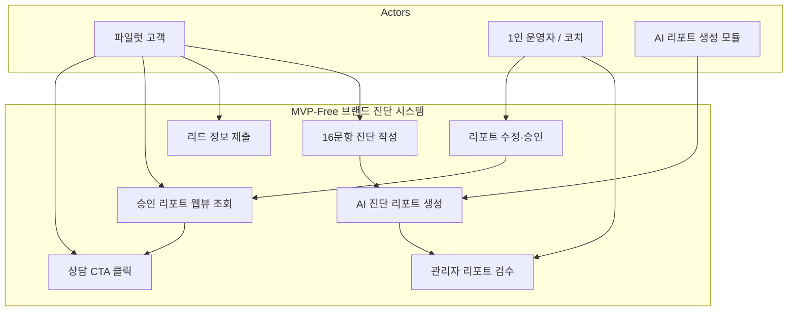
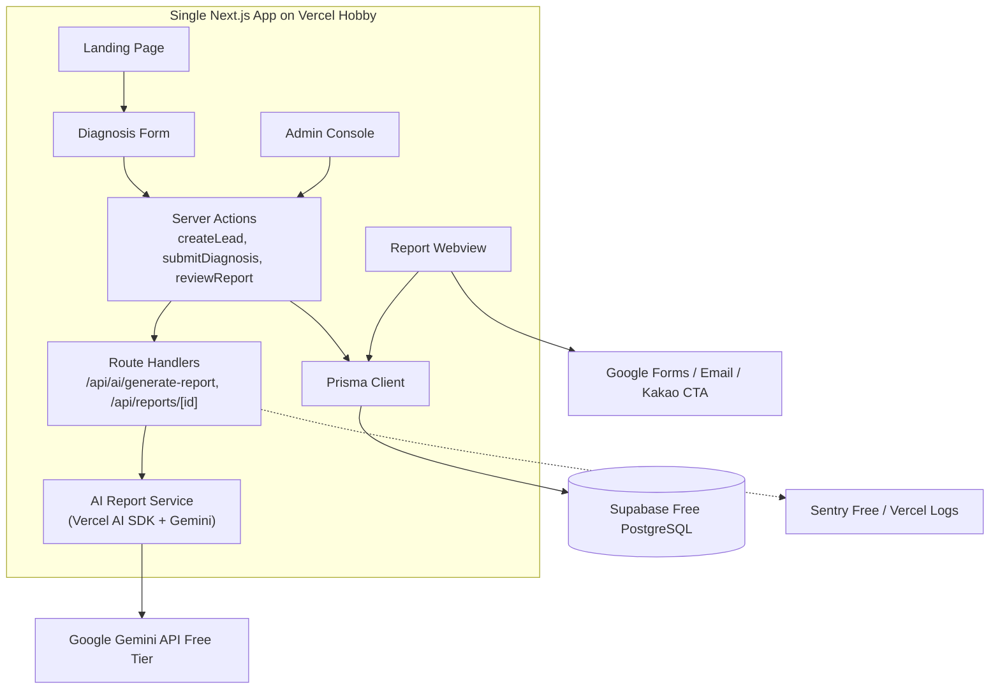
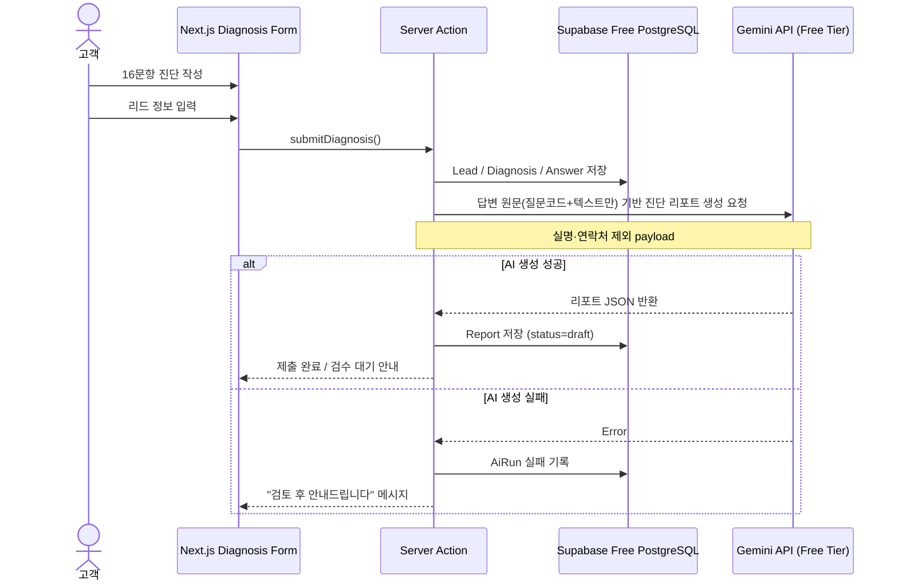
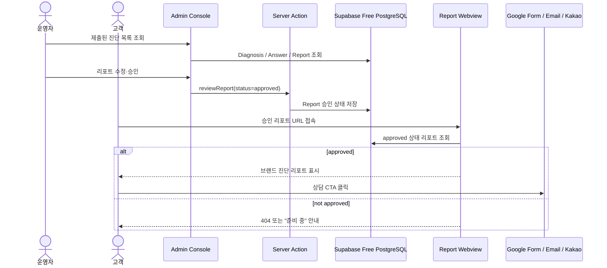
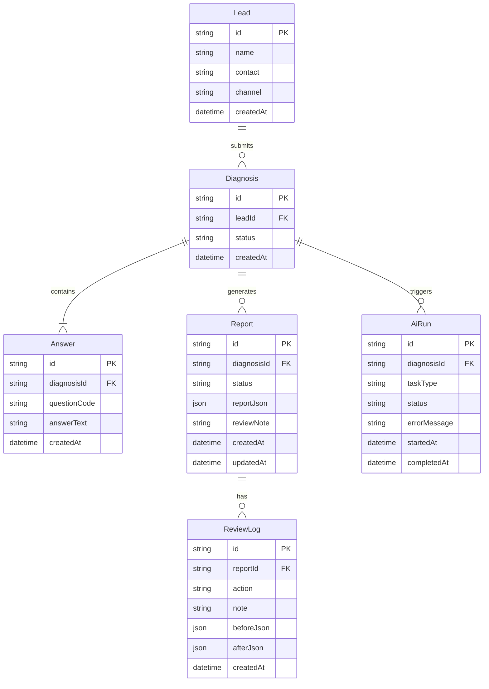

# Software Requirements Specification (SRS)

Document ID: SRS-001
Revision: 1.3
Date: 2026-04-26
Standard: ISO/IEC/IEEE 29148:2018

---

| 항목 | 내용 |
| :--- | :--- |
| **Document ID** | SRS-001 |
| **Revision** | 1.3 |
| **Date** | 2026-04-26 |
| **Standard** | ISO/IEC/IEEE 29148:2018 |
| **Source PRD** | PRD_v0_4_2.md (5060 프리미엄 브랜드 매니지먼트 PRD v0.4.2) |
| **Status** | Draft — Zero-Cost Personal MVP Revision |
| **Authors** | 브랜드 매니지먼트 사업부 (AI Ops / Personal MVP Revision) |

### 개정 이력

| 개정 번호 | 날짜 | 작성자 | 변경 내용 요약 |
| :---: | :--- | :--- | :--- |
| 1.0 | 2026-04-25 | AI Ops | 초안 작성 — PRD v0.4.2 기반 전체 SRS 초안 |
| 1.1 | 2026-04-26 | AI Ops | 검토 결과서 반영 — 누락 AC 보완, 다이어그램 4종 추가, ANSWER 엔터티 신설, Traceability Matrix AC 단위 확장, State Model 추가 |
| **1.3** | **2026-04-26** | **AI Ops / Personal MVP Revision** | **Zero-Cost Personal MVP 조정** — 개인 구현 가능성과 완전 무료 인프라 제약을 반영하여 MVP 범위를 축소. 16문항 진단·리드/답변 저장·AI 진단 리포트·관리자 검수·승인 리포트 웹뷰·상담 CTA를 P0로 재정의. 마스터 브리프 8섹션, 42문항 전체 처리, F15 코치 분석 노트, 원라이너 3종, 교차검증 9개, Datadog/UptimeRobot/Slack Alert, Typeform 자동 연동, 복잡한 RBAC는 V1.5/V2로 이동. 99.9% SLA 및 고동시접속 요구를 제거하고 Best-effort 무료 파일럿 기준으로 비기능 요구사항 재작성. |

---

## 1. Introduction

### 1.1 Purpose

본 SRS v1.3은 **5060 프리미엄 브랜드 매니지먼트 시스템**의 장기 제품 비전을 유지하되, 1차 구현 범위를 **완전 무료 인프라 기반 개인 구현 가능 MVP**로 축소하여 명세하는 것을 목적으로 한다.

v1.3의 핵심 목적은 다음과 같다.

- 5060 고경력 전문가가 축약 16문항 진단에 응답하고
- 시스템이 리드 정보와 답변 원문을 저장하며
- AI가 답변 원문을 바탕으로 브랜드 강점·약점·방향성·상담 CTA를 포함한 진단 리포트를 생성하고
- 운영자가 해당 리포트를 검수·수정·승인한 뒤
- 승인된 리포트 웹뷰를 고객에게 제공하여 프리미엄 매니지먼트 상담 전환 가능성을 검증하는 것이다.

본 v1.3 문서는 상업용 안정 운영 시스템을 목표로 하지 않는다. 목표는 **초급 수준의 SW 배경지식을 가진 1인이 AI 코딩 도구를 활용해 3~4주 내 구축 가능한 무료 파일럿 MVP**를 정의하는 것이다.

42문항 전체 처리, 마스터 브리프 8섹션 자동 생성, 원라이너 3종 자동 생성, F15 코치 분석 노트, 교차검증 9개 매트릭스, 고가용성 SLA, 고동시접속 처리, 유료 모니터링 자동화는 v1.3 범위에서 제외하고 V1.5 또는 V2로 이동한다.

---

### 1.2 Scope

#### In-Scope (MVP-Free V1.3)

| # | 항목 | 대응 기능 | 구현 우선순위 |
| :---: | :--- | :--- | :---: |
| S1 | 랜딩페이지 | 서비스 소개, 진단 시작 CTA | P0 |
| S2 | 축약 16문항 진단 폼 | Q1·Q2·Q4·Q6·Q7·Q8·Q9·Q11·Q13·Q15·Q26·Q28·Q33·Q40·Q41·Q42 | P0 |
| S3 | 질문별 브랜드 자산 안내 | 각 질문이 어떤 브랜드 자산으로 연결되는지 안내 | P0 |
| S4 | 리드 정보 저장 | 이름, 이메일 또는 전화번호, 유입경로 저장 | P0 |
| S5 | 답변 원문 저장 | 16문항 답변 원문 저장 | P0 |
| S6 | AI 진단 리포트 생성 | 강점, 약점, 브랜드 방향, 추천 문장, 상담 CTA 생성 | P0 |
| S7 | 관리자 목록 화면 | 제출된 진단 목록 조회 | P0 |
| S8 | 관리자 상세 화면 | 리드 정보, 답변 원문, AI 리포트 조회 | P0 |
| S9 | 관리자 검수·수정·승인 | AI 리포트 수정, 승인, 재생성 요청 | P0 |
| S10 | 승인 리포트 웹뷰 | 승인된 리포트만 고객 공유용 URL로 제공 | P0 |
| S11 | 상담 CTA 연결 | 구글폼, 이메일, 카카오 채널 등 무료 수단 중 하나로 연결 | P0 |
| S12 | 최소 AI 호출 로그 | AI 호출 성공/실패, 생성 시간, 오류 메시지 저장 | P1 |

#### Out-of-Scope (MVP-Free V1.3 제외)

| # | 항목 | 이동 단계 | 제외 이유 |
| :---: | :--- | :---: | :--- |
| O1 | 결제 시스템 | V2 | 무료 파일럿 MVP에서는 수동 상담 전환만 검증 |
| O2 | SNS 회원가입 / OAuth 로그인 | V2 | 단일 관리자 운영으로 대체 |
| O3 | 42문항 전체 진단 | V1.5 | 개인 구현 난이도 및 고객 이탈 리스크 |
| O4 | 마스터 브리프 8섹션 자동 생성 | V1.5 | 장문 AI 생성 품질·검수 부담 |
| O5 | 원라이너 3종 자동 생성 | V1.5 | 진단 리포트 검증 후 후속 도입 |
| O6 | F15 코치 분석 노트 자동 생성 | V1.5 | 초기에는 관리자 메모로 대체 |
| O7 | 교차검증 9개 매트릭스 | V2 | AI 평가 로직 복잡도 과다 |
| O8 | Typeform 자동 연동 | V2 | 구글폼/수동 설문으로 대체 |
| O9 | Datadog / UptimeRobot / Slack Critical Alert | V2 | 무료 MVP에 과도한 운영 자동화 |
| O10 | 복잡한 RBAC | V2 | 단일 관리자 인증으로 대체 |
| O11 | 고객 대시보드 | V2 | 승인 리포트 웹뷰로 대체 |
| O12 | PPT/PDF 자동 Export | V2 | 수동 제작으로 대체 |
| O13 | 모바일 네이티브 앱 | V2 | 웹 기반 MVP 우선 |
| O14 | 완전 자동 코칭 / 무검수 납품 | 영구 또는 V2 이후 | 품질·환각·브랜드 리스크 |
| O15 | 심리상담 또는 치료적 해석 | 영구 제외 | 제품 범위 밖 |

#### Constraints (제약사항 및 가정) — MVP-Free V1.3

| # | 구분 | 내용 |
| :---: | :--- | :--- |
| C-FREE-001 | 개발 주체 | 본 MVP는 초급 수준의 SW 배경지식을 가진 1인이 AI 코딩 도구를 활용해 구현하는 것을 전제로 한다 |
| C-FREE-002 | 개발 방식 | 구현은 완전 바이브코딩 기반으로 진행하며, 기능은 작은 단위의 Build Step으로 분해되어야 한다 |
| C-FREE-003 | 인프라 비용 | MVP-Free 단계의 목표 인프라 비용은 월 0원이다. 유료 플랜이 필요한 기능은 V1.5 또는 V2로 이동한다 |
| C-FREE-004 | 배포 환경 | 배포는 Vercel Hobby 또는 이에 준하는 무료 배포 환경을 사용한다. 단, 상업 운영 시 유료 플랜 전환이 필요하다 |
| C-FREE-005 | 데이터베이스 | Supabase Free 또는 이에 준하는 무료 PostgreSQL 환경을 사용한다. 대규모 저장·백업·고가용성은 보장하지 않는다 |
| C-FREE-006 | AI API | Gemini API 무료 티어 또는 저비용 모델을 우선 사용한다. 실제 고객 데이터 사용 시 익명화 또는 명시적 동의를 선행한다 |
| C-FREE-007 | SLA | MVP-Free 단계에서는 공식 SLA를 제공하지 않는다. 서비스 가용성은 Best-effort로 운영한다 |
| C-FREE-008 | 동시접속 | 동시 진단 제출 3명, 동시 리포트 조회 10명 수준의 파일럿 사용만 지원 대상으로 한다 |
| C-FREE-009 | 운영 자동화 | Datadog, UptimeRobot, Slack Critical Alert, Typeform 자동 연동은 MVP-Free 범위에서 제외한다 |
| C-FREE-010 | 사람 검수 | AI 생성 리포트는 고객에게 자동 공개하지 않고 관리자 검수·수정·승인 후 공개한다 |
| C-FREE-011 | 데이터 보호 | 실명, 연락처, 식별 가능한 경력정보는 AI API 전송 payload에서 제외하거나 익명화한다 |
| C-FREE-012 | 상업 운영 전환 | 유료 고객, 월 50명 이상 진단, 고객 데이터 장기 저장, 장애 허용 불가 상황이 발생하면 유료 인프라 전환을 검토한다 |

---

### 1.3 Definitions, Acronyms, Abbreviations

| 용어 / 약어 | 정의 |
| :--- | :--- |
| **5060 전문가** | 50~60대 고경력 임원·연구원·전문직 종사자 |
| **MVP-Free** | 완전 무료 인프라와 개인 구현 가능성을 전제로 한 초경량 파일럿 MVP 단계 |
| **Best-effort 운영** | 공식 SLA 없이 무료 인프라 제공자의 상태와 사용량 제한 내에서 가능한 수준으로 운영하는 방식 |
| **Hard Requirement** | MVP가 작동하기 위해 반드시 충족해야 하는 요구사항 |
| **Soft Target** | 달성하면 좋지만 무료 인프라에서 보장하지 않는 목표 |
| **Manual Alternative** | 자동화 기능을 구현하지 않고 운영자의 수동 작업으로 대체하는 방식 |
| **Deferred** | MVP-Free에서는 제외하고 V1.5 또는 V2로 이동한 요구사항 |
| **Not Guaranteed** | 무료 인프라 제약상 보장하지 않는 항목 |
| **승인 리포트 웹뷰** | 관리자가 검수·승인한 AI 진단 리포트를 고객에게 공유하는 웹 페이지 |
| **AI 진단 리포트** | 16문항 답변을 바탕으로 생성되는 강점·약점·브랜드 방향·추천 CTA 중심의 초경량 결과물 |
| **바이브코딩** | AI 코딩 도구를 활용하여 개발 전문성 없이 단계적으로 구현하는 방식 |
| **마스터 브리프** | 42문항 인터뷰 분석 결과를 8개 섹션으로 구조화한 최종 브랜드 자산 문서 (V1.5 범위) |
| **브랜드 원라이너** | "나는 [대상]이 [문제]를 해결하도록 [방식]으로 돕는 사람이다" 구조의 1문장 (V1.5 범위) |
| **Server Action** | Next.js App Router에서 서버 측에서 실행되는 비동기 함수 |
| **Route Handler** | Next.js의 `app/api/` 하위 파일로 정의되는 HTTP 핸들러 |
| **Prisma** | Node.js/TypeScript ORM. SQLite(로컬) ↔ PostgreSQL(운영) 동일 스키마 사용 |
| **AiRun** | AI 호출 1회를 추적하는 DB 모델 |
| **Done-for-you** | 전문가가 대신 완성해주는 서비스 형태 |
| **CTA** | Call-to-Action |

---

### 1.4 References

| Ref ID | 문서명 | 출처 |
| :--- | :--- | :--- |
| REF-01 | PRD v0.4.2 — 5060 프리미엄 브랜드 매니지먼트 | 브랜드 매니지먼트 사업부 (2026-04-25) |
| REF-02 | AI 작업용 SRS 수정 PLAN (v1.1 → v1.3) | AI Ops (2026-04-26) |
| REF-03 | 나다운 브랜딩 5060 AI 개발용 코칭 가이드 완전판 | 꿈몰다 내부 IP |
| REF-04 | 나다운 브랜딩 5060 코칭 가이드 42문항 | 꿈몰다 내부 IP |
| REF-05 | ISO/IEC/IEEE 29148:2018 | 국제 표준 |
| REF-06 | SRS v1.1 검토 결과서 | AI Ops (2026-04-26) |
| REF-07 | SRS v1.2 개정 적용 Plan (Next.js MVP Architecture) | AI Ops (2026-04-26) |
| REF-08 | Next.js App Router 공식 문서 | https://nextjs.org/docs |
| REF-09 | Vercel Pricing / Hobby Plan | https://vercel.com/pricing |
| REF-10 | Vercel Fair Use Guidelines | https://vercel.com/docs/limits/fair-use-guidelines |
| REF-11 | Supabase Pricing | https://supabase.com/pricing |
| REF-12 | Gemini API Pricing | https://ai.google.dev/gemini-api/docs/pricing |
| REF-13 | Prisma Documentation | https://www.prisma.io/docs |
| REF-14 | Tailwind CSS Documentation | https://tailwindcss.com/docs |
| REF-15 | shadcn/ui Documentation | https://ui.shadcn.com |

---

## 2. Stakeholders

| 역할 | 책임 | 관심사 |
| :--- | :--- | :--- |
| **파일럿 고객** | 16문항 진단 응답, 승인 리포트 확인, 상담 CTA 클릭 | 자기인식, 브랜드 방향성 확인, 상담 필요성 판단 |
| **1인 운영자 / 코치** | 진단 결과 검수, 리포트 수정·승인, 상담 연결 | 고객 가치 전달, AI 결과 품질 통제, 운영 부담 최소화 |
| **1인 개발자 / 바이브코딩 수행자** | Next.js 기반 MVP 구현, 무료 인프라 설정, 오류 수정 | 구현 난이도 최소화, 비용 0원 유지, 단계별 개발 가능성 |
| **AI 리포트 생성 모듈** | 답변 원문 기반 진단 리포트 생성 | 원문 기반성, 환각 최소화, JSON 구조화 출력 |
| **비즈니스 오너** | 파일럿 검증, 상담 전환율 확인, 유료화 판단 | MVP 가치 검증, 유료 전환 기준 판단 |

> **운영 특성:** 운영자·코치·개발자는 초기에 동일 1인이 수행하는 것을 전제로 한다.

### Use Case Diagram — MVP-Free



---

## 3. System Context and Interfaces

### 3.1 External Systems — MVP-Free

| 외부 시스템 | 연동 방식 | 역할 | MVP-Free 사용 여부 |
| :--- | :--- | :--- | :---: |
| **Vercel Hobby** | Git 기반 배포 | Next.js 앱 무료 배포 | 사용 |
| **Supabase Free** | PostgreSQL / Prisma | 리드, 답변, 리포트 저장 | 사용 |
| **Google Gemini API Free Tier** | HTTPS API / Vercel AI SDK | AI 진단 리포트 생성 | 사용 |
| **Google Forms** | 외부 링크 | 상담 신청 또는 피드백 수집 | 선택 |
| **GA4** | JavaScript SDK | 기본 방문/CTA 이벤트 추적 | 선택 |
| **Sentry Developer Free** | SDK | 오류 추적 | 선택 |
| **Typeform** | SaaS API | 자동 설문 | 제외 / V2 |
| **Datadog** | SaaS SDK | 고급 모니터링 | 제외 / V2 |
| **UptimeRobot** | 외부 핑 | 가용성 모니터링 | 제외 / V2 |
| **Slack Alert** | Webhook | 실시간 장애 알림 | 제외 / V2 |

### 3.2 Component Diagram — MVP-Free (Single Next.js App)



### 3.3 API / Action Overview — MVP-Free

#### Server Actions

| Action | 호출 주체 | 설명 | 우선순위 |
| :--- | :--- | :--- | :---: |
| `createLead()` | 진단 폼 | 리드 정보 저장 | P0 |
| `submitDiagnosis()` | 진단 폼 | 16문항 답변 저장 및 AI 리포트 생성 요청 | P0 |
| `reviewReport()` | 관리자 | AI 리포트 수정·승인·거부 처리 | P0 |
| `regenerateReport()` | 관리자 | AI 리포트 재생성 요청 | P1 |

#### Route Handlers

| Route | Method | 설명 | 우선순위 |
| :--- | :---: | :--- | :---: |
| `/api/ai/generate-report` | POST | Gemini API를 호출하여 진단 리포트 JSON 생성 | P0 |
| `/api/reports/[id]` | GET | 승인된 리포트 조회 | P0 |

#### Deferred APIs (V1.5/V2)

| 기존 API | 이동 단계 | 이유 |
| :--- | :---: | :--- |
| `/api/ai/master-brief` | V1.5 | 마스터 브리프 자동 생성 후순위 |
| `/api/ai/coach-brief` | V1.5 | F15 코치 분석 노트 후순위 |
| `/api/ai/classify-patterns` | V1.5 | 세부 패턴 분류는 리포트 프롬프트 내부로 단순화 |
| `/api/ai/map-branding` | V1.5 | 별도 API 대신 리포트 생성 내 포함 |
| `/api/admin/projects` | V1.5 | MVP-Free는 단순 진단 목록으로 대체 |
| `/api/clients/[id]/dashboard` | V2 | 고객 대시보드 제외 |

### 3.4 Interaction Sequences — MVP-Free (2개)

#### 시퀀스 1: 고객 진단 제출 → AI 리포트 생성



#### 시퀀스 2: 관리자 검수 → 승인 리포트 웹뷰 → 상담 CTA



---

## 4. Specific Requirements

### 4.1 Functional Requirements — MVP-Free

#### F2-Lite — 16문항 브랜드 진단 폼

| REQ-ID | 요구사항 | Priority | Acceptance Criteria |
| :--- | :--- | :---: | :--- |
| REQ-FREE-FUNC-001 | 시스템은 축약 16문항 진단 폼을 `/diagnose` 페이지에 제공해야 한다. | Must | 고객이 16문항을 PART 순서대로 확인하고 답변할 수 있다 |
| REQ-FREE-FUNC-002 | 각 질문에는 해당 답변이 어떤 브랜드 자산에 연결되는지 안내 문구를 표시해야 한다. | Must | 모든 질문 카드에 브랜드 자산 안내가 표시된다 |
| REQ-FREE-FUNC-003 | 이름, 이메일 또는 전화번호 중 최소 1개 연락처를 입력받아야 한다. | Must | 연락처 미입력 시 제출이 차단된다 |
| REQ-FREE-FUNC-004 | 답변이 3단어 미만이거나 공백인 경우 제출을 차단해야 한다. | Must | 유효하지 않은 답변이 있으면 오류 메시지가 표시된다 |

#### F4-Lite — 리드 및 답변 저장

| REQ-ID | 요구사항 | Priority | Acceptance Criteria |
| :--- | :--- | :---: | :--- |
| REQ-FREE-FUNC-010 | 시스템은 리드 정보를 Lead 테이블에 저장해야 한다. | Must | Lead 레코드가 생성된다 |
| REQ-FREE-FUNC-011 | 시스템은 16문항 답변 원문을 질문 코드와 함께 Answer 테이블에 저장해야 한다. | Must | Answer 레코드 16개가 생성된다 |
| REQ-FREE-FUNC-012 | 진단 제출 후 Diagnosis 상태는 `submitted` 또는 `report_pending`으로 저장되어야 한다. | Must | Diagnosis.status가 정상 저장된다 |

#### F-AI-Lite — AI 진단 리포트 생성

| REQ-ID | 요구사항 | Priority | Acceptance Criteria |
| :--- | :--- | :---: | :--- |
| REQ-FREE-FUNC-020 | 시스템은 16문항 답변 원문을 바탕으로 AI 진단 리포트를 생성해야 한다. | Must | 강점, 약점, 브랜드 방향, 추천 문장, 상담 CTA가 포함된 JSON이 생성된다 |
| REQ-FREE-FUNC-021 | AI 리포트는 답변 원문에 근거한 질문 번호(sourceQuestionCodes)를 포함해야 한다. | Must | 리포트 각 주요 항목에 sourceQuestionCodes가 포함된다 |
| REQ-FREE-FUNC-022 | AI 리포트 생성 실패 시 사용자에게 "검수 후 안내" 메시지를 표시해야 한다. | Must | 실패해도 답변 데이터는 저장되고 실패 상태가 기록된다 |
| REQ-FREE-FUNC-023 | AI API 요청 payload에는 실명, 이메일, 전화번호를 포함하지 않아야 한다. | Must | payload에는 답변 텍스트와 질문 코드만 포함된다 |

#### F3-Lite — 관리자 검수

| REQ-ID | 요구사항 | Priority | Acceptance Criteria |
| :--- | :--- | :---: | :--- |
| REQ-FREE-FUNC-030 | 관리자는 `/admin`에서 제출된 진단 목록을 확인할 수 있어야 한다. | Must | 진단 목록이 최신순으로 표시된다 |
| REQ-FREE-FUNC-031 | 관리자는 `/admin/diagnoses/[id]`에서 답변 원문과 AI 리포트를 확인할 수 있어야 한다. | Must | 상세 조회 화면에서 답변과 리포트가 표시된다 |
| REQ-FREE-FUNC-032 | 관리자는 AI 리포트 내용을 직접 수정할 수 있어야 한다. | Must | 수정 후 Report 내용이 저장된다 |
| REQ-FREE-FUNC-033 | 관리자는 리포트를 승인(`approved`) 또는 거부(`rejected`)할 수 있어야 한다. | Must | Report.status가 정상 변경된다 |
| REQ-FREE-FUNC-034 | 승인되지 않은 리포트는 고객 웹뷰에서 표시되지 않아야 한다. | Must | draft/rejected 상태의 리포트는 `/report/[id]` 접근 시 차단된다 |

#### F-Report-Lite — 승인 리포트 웹뷰 및 CTA

| REQ-ID | 요구사항 | Priority | Acceptance Criteria |
| :--- | :--- | :---: | :--- |
| REQ-FREE-FUNC-040 | 승인된 리포트는 `/report/[id]`에서 고객 웹뷰로 표시되어야 한다. | Must | approved 상태의 리포트만 표시된다 |
| REQ-FREE-FUNC-041 | 리포트 하단에는 상담 CTA가 표시되어야 한다. | Must | 구글폼, 이메일, 카카오 채널 중 하나로 연결된다 |
| REQ-FREE-FUNC-042 | CTA 클릭은 기본 이벤트로 기록할 수 있어야 한다. | Should | GA4 또는 단순 DB 로그 중 하나로 기록된다 |

### 4.1.9 Deferred Functional Requirements

기존 고급 요구사항은 삭제하지 않고 아래로 이동한다.

| 기존 기능 | 기존 REQ 범위 | 이동 단계 | 비고 |
| :--- | :--- | :---: | :--- |
| AI 마스터 브리프 생성기 | REQ-FUNC-001~006 | V1.5 | 8섹션 자동 생성 후순위 |
| Answer Pattern Classifier 고도화 | REQ-FUNC-050~059 | V1.5 | MVP-Free에서는 리포트 프롬프트 내부 처리 |
| Branding Output Mapper | REQ-FUNC-060~063 | V1.5 | 별도 매핑 엔진 후순위 |
| Coach Session Brief Generator | REQ-FUNC-070~078 | V1.5 | 관리자 메모로 대체 |
| 답변 충분성 자동 평가 | REQ-FUNC-080~083 | V1.5 | 기본 유효성 검사만 유지 |
| 교차 분석 요구사항 | REQ-FUNC-090~093 | V2 | 고급 AI 평가 로직 |
| 42문항 OUTPUT 변수 스키마 | REQ-FUNC-100~102 | V1.5 | 16문항 리포트 스키마 우선 |
| LLM 고급 재시도/알림 | REQ-FUNC-110~112 | V2 | 단순 실패 메시지로 대체 |

---

### 4.2 Non-Functional Requirements — MVP-Free 기준

#### 성능

| REQ-ID | 요구사항 | 등급 | 측정 기준 |
| :--- | :--- | :---: | :--- |
| REQ-NF-FREE-001 | 랜딩페이지는 일반 네트워크 환경에서 3초 이내 표시를 목표로 한다. | Soft Target | 수동 브라우저 테스트 |
| REQ-NF-FREE-002 | 진단 폼 제출 후 DB 저장은 5초 이내 완료를 목표로 한다. | Soft Target | 제출 시간 수동 확인 |
| REQ-NF-FREE-003 | AI 리포트 생성은 60초 이내 완료를 목표로 하며, 초과 시 "처리 중" 또는 "검수 대기" 안내를 표시한다. | Soft Target | AiRun 생성/완료 시간 |
| REQ-NF-FREE-004 | 동시 진단 제출은 3명 수준을 지원 대상으로 한다. | Hard Requirement | 수동 동시 제출 테스트 |
| REQ-NF-FREE-005 | 동시 리포트 조회는 10명 수준을 지원 대상으로 한다. | Hard Requirement | 수동 브라우저 테스트 |

#### 가용성

| REQ-ID | 요구사항 | 등급 | 측정 기준 |
| :--- | :--- | :---: | :--- |
| REQ-NF-FREE-010 | MVP-Free는 공식 SLA를 제공하지 않는다. | Not Guaranteed | 문서 명시 |
| REQ-NF-FREE-011 | 장애 발생 시 운영자가 수동으로 확인하고 복구한다. | Manual Alternative | 운영 체크리스트 |
| REQ-NF-FREE-012 | UptimeRobot, Datadog, Slack Critical 알림은 MVP-Free 범위에서 제외한다. | Deferred | 도구 미사용 확인 |

#### 비용

| REQ-ID | 요구사항 | 등급 | 측정 기준 |
| :--- | :--- | :---: | :--- |
| REQ-NF-FREE-020 | MVP-Free는 월 인프라 비용 0원을 목표로 한다. | Hard Requirement | 유료 플랜 미사용 |
| REQ-NF-FREE-021 | 유료 플랜 전환이 필요한 기능은 V1.5/V2로 분리한다. | Hard Requirement | 기능 범위 확인 |
| REQ-NF-FREE-022 | 커스텀 도메인, 유료 모니터링, 유료 설문 도구는 사용하지 않는다. | Hard Requirement | 도구 미사용 확인 |
| REQ-NF-FREE-023 | AI 호출은 1회 진단 제출당 기본 1회, 관리자 재생성 1회까지로 제한한다. | Hard Requirement | AiRun 로그 확인 |

#### 데이터 보호

| REQ-ID | 요구사항 | 등급 | 측정 기준 |
| :--- | :--- | :---: | :--- |
| REQ-NF-FREE-030 | AI API에는 실명, 연락처, 식별 가능한 민감 경력정보를 전송하지 않는다. | Hard Requirement | 전송 payload 확인 |
| REQ-NF-FREE-031 | 실제 고객 답변 사용 시 명시적 동의 또는 익명화를 선행한다. | Hard Requirement | 동의 체크박스 확인 |
| REQ-NF-FREE-032 | 무료 AI API 사용 시 데이터 처리 약관을 검토하고, 상업 운영 전 유료 전환 여부를 재판단한다. | Hard Requirement | 운영 전 체크리스트 |
| REQ-NF-FREE-033 | 승인되지 않은 리포트는 외부 URL로 공개되지 않아야 한다. | Hard Requirement | 접근 제어 테스트 |

#### 품질

| REQ-ID | 요구사항 | 등급 | 측정 기준 |
| :--- | :--- | :---: | :--- |
| REQ-NF-FREE-040 | AI 리포트는 원문 답변에 근거한 질문 번호(sourceQuestionCodes)를 포함해야 한다. | Hard Requirement | 리포트 JSON 확인 |
| REQ-NF-FREE-041 | 관리자는 AI 리포트를 수정·승인할 수 있어야 한다. | Hard Requirement | 관리자 검수 테스트 |
| REQ-NF-FREE-042 | AI 품질 정확도 지표는 자동 측정하지 않고 운영자 수동 평가로 관리한다. | Manual Alternative | 수동 검수 로그 |

---

## 5. Traceability Matrix — MVP-Free V1.3

| PRD Source | PRD ID / 기존 REQ | 요약 | v1.3 상태 | MVP-Free REQ-ID |
| :--- | :--- | :--- | :--- | :--- |
| Feature | F2 AI 브랜드 진단 툴 | 16문항 진단 폼 | Covered in MVP-Free | REQ-FREE-FUNC-001~004 |
| Feature | F4 리드 DB | 리드/답변 저장 | Covered in MVP-Free | REQ-FREE-FUNC-010~012 |
| Feature | F3 관리자 콘솔 | 목록/상세/수정/승인만 | Simplified in MVP-Free | REQ-FREE-FUNC-030~034 |
| Feature | F-AI (신규) | AI 진단 리포트 생성 | Covered in MVP-Free | REQ-FREE-FUNC-020~023 |
| Feature | F-Report (신규) | 승인 리포트 웹뷰 + CTA | Covered in MVP-Free | REQ-FREE-FUNC-040~042 |
| Feature | F9 Question Architecture | 16문항 메타데이터만 | Simplified in MVP-Free | REQ-FREE-FUNC-001 |
| Feature | F10 Answer Pattern Classifier | 리포트 프롬프트 내부 처리 | Simplified in MVP-Free | REQ-FREE-FUNC-020 |
| Feature | F1 마스터 브리프 생성기 | REQ-FUNC-001~006 | Deferred to V1.5 | — |
| Feature | F11 Branding Output Mapper | REQ-FUNC-060~063 | Deferred to V1.5 | — |
| Feature | F15 Coach Session Brief Generator | REQ-FUNC-070~078 | Deferred to V1.5 | — |
| AC | AC-Suf-1~3 (답변 충분성) | 자동 충분성 평가 | Deferred to V1.5 | — |
| AC | AC-Cross-1~4 (교차 분석) | 교차 검증 9개 | Deferred to V2 | — |
| AC | AC-Logic-1~7 (42문항 OUTPUT) | 42문항 변수 스키마 | Deferred to V1.5 | — |
| NFR | 99.9% SLA | 고가용성 SLA | Removed from MVP-Free | REQ-NF-FREE-010 |
| NFR | 동시 100명 / 500명 | 고동시접속 | Removed from MVP-Free | REQ-NF-FREE-004~005 |
| NFR | Datadog / UptimeRobot / Slack Alert | 운영 자동화 | Removed from MVP-Free | REQ-NF-FREE-012 |
| NFR | Typeform NPS 자동 발송 | 자동 설문 | Deferred to V2 | — |
| NFR | AI 품질 KPI 자동 측정 | 패턴 분류 정확도 등 | Deferred to V2 | REQ-NF-FREE-042 |
| Story | US-1 (질문별 자산 매핑 안내) | 브랜드 자산 안내 표시 | Covered in MVP-Free | REQ-FREE-FUNC-002 |
| Story | US-2 (코치 분석 노트) | Stage 1 노트 자동 생성 | Deferred to V1.5 | — |
| Story | US-3 (5060 특화 신호) | 패턴별 스크립트 | Deferred to V1.5 | — |
| Story | US-4 (변화점 시각화) | Stage 1→3 변화 | Deferred to V2 | — |
| Story | US-5 (원라이너 3종) | 원라이너 자동 생성 | Deferred to V1.5 | — |
| Story | US-6 (원천 추적) | sourceQuestionCodes | Covered in MVP-Free | REQ-FREE-FUNC-021 |
| Story | US-7 (일관성 충돌 감지) | 교차 검증 | Deferred to V2 | — |
| Tech | 무료 인프라 제약 | Vercel Hobby / Supabase Free | Covered in MVP-Free | C-FREE-001~012 |
| Tech | 데이터 보호 | AI API 익명화 | Covered in MVP-Free | REQ-NF-FREE-030~033 |

---

## 6. Appendix

### Appendix A. MVP-Free 최소 DB 모델

#### 필수 엔터티

| Entity | 필수 여부 | 설명 |
| :--- | :---: | :--- |
| Lead | 필수 | 파일럿 고객의 이름, 연락처, 유입경로 |
| Diagnosis | 필수 | 진단 제출 단위와 상태 |
| Answer | 필수 | 질문 코드별 답변 원문 |
| Report | 필수 | AI 진단 리포트 및 승인 상태 |
| AiRun | 권장 | AI 호출 로그 |
| ReviewLog | 권장 | 관리자 수정·승인 이력 |
| AdminUser | 선택 | 단일 관리자 인증 정보 |

#### 최소 상태값

| Entity | 상태값 |
| :--- | :--- |
| Diagnosis | `submitted`, `report_pending`, `report_generated`, `reviewed` |
| Report | `draft`, `approved`, `rejected`, `regeneration_requested` |
| AiRun | `pending`, `processing`, `completed`, `failed` |

#### Prisma Schema 초안 — MVP-Free

```prisma
// schema.prisma — MVP-Free 최소 모델

generator client {
  provider = "prisma-client-js"
}

datasource db {
  provider = env("DATABASE_PROVIDER") // "sqlite" | "postgresql"
  url      = env("DATABASE_URL")
}

model Lead {
  id        String      @id @default(cuid())
  name      String
  contact   String      // 이메일 또는 전화번호
  channel   String?     // 유입 경로
  createdAt DateTime    @default(now())
  diagnoses Diagnosis[]
}

model Diagnosis {
  id        String   @id @default(cuid())
  leadId    String
  lead      Lead     @relation(fields: [leadId], references: [id])
  status    String   @default("submitted")
  // submitted | report_pending | report_generated | reviewed
  createdAt DateTime @default(now())
  answers   Answer[]
  reports   Report[]
  aiRuns    AiRun[]
}

model Answer {
  id           String    @id @default(cuid())
  diagnosisId  String
  diagnosis    Diagnosis @relation(fields: [diagnosisId], references: [id])
  questionCode String    // "Q1", "Q2", ...
  answerText   String
  createdAt    DateTime  @default(now())
}

model Report {
  id          String      @id @default(cuid())
  diagnosisId String
  diagnosis   Diagnosis   @relation(fields: [diagnosisId], references: [id])
  status      String      @default("draft")
  // draft | approved | rejected | regeneration_requested
  reportJson  Json?       // AI 생성 리포트 JSON (Zod 검증 통과)
  reviewNote  String?     // 관리자 수정 메모
  createdAt   DateTime    @default(now())
  updatedAt   DateTime    @updatedAt
  reviewLogs  ReviewLog[]
}

model AiRun {
  id           String    @id @default(cuid())
  diagnosisId  String?
  diagnosis    Diagnosis? @relation(fields: [diagnosisId], references: [id])
  taskType     String    // "generateReport" | "regenerateReport"
  provider     String    @default("gemini")
  status       String    @default("pending")
  // pending | processing | completed | failed
  errorMessage String?
  startedAt    DateTime?
  completedAt  DateTime?
  createdAt    DateTime  @default(now())
}

model ReviewLog {
  id         String   @id @default(cuid())
  reportId   String
  report     Report   @relation(fields: [reportId], references: [id])
  action     String   // "approve" | "reject" | "modify" | "regenerate_request"
  note       String?
  beforeJson Json?
  afterJson  Json?
  createdAt  DateTime @default(now())
}
```

---

### Appendix B. AI 진단 리포트 JSON Schema

MVP-Free의 AI 진단 리포트는 마스터 브리프가 아닌 아래 초경량 스키마를 따른다.

```json
{
  "summary": "고객 답변을 바탕으로 한 3~5문장 요약",
  "strengths": [
    {
      "title": "핵심 강점",
      "description": "강점 설명",
      "sourceQuestionCodes": ["Q1", "Q6"]
    }
  ],
  "weaknesses": [
    {
      "title": "보완 지점",
      "description": "보완 설명",
      "sourceQuestionCodes": ["Q15"]
    }
  ],
  "brandDirection": {
    "oneSentence": "브랜드 방향 한 문장",
    "description": "브랜드 방향 설명",
    "sourceQuestionCodes": ["Q26", "Q41"]
  },
  "recommendedNextStep": {
    "message": "상담 CTA 문구",
    "ctaLabel": "상담 신청하기"
  },
  "warnings": [
    "답변이 짧아 해석 신뢰도가 낮을 수 있습니다."
  ]
}
```

#### Zod Schema (TypeScript)

```typescript
// lib/schemas/report.schema.ts
import { z } from "zod"

const StrengthSchema = z.object({
  title: z.string(),
  description: z.string(),
  sourceQuestionCodes: z.array(z.string()),
})

const BrandDirectionSchema = z.object({
  oneSentence: z.string().max(80),
  description: z.string(),
  sourceQuestionCodes: z.array(z.string()),
})

export const DiagnosisReportSchema = z.object({
  summary: z.string().min(30).max(500),
  strengths: z.array(StrengthSchema).min(1).max(5),
  weaknesses: z.array(StrengthSchema).min(1).max(3),
  brandDirection: BrandDirectionSchema,
  recommendedNextStep: z.object({
    message: z.string(),
    ctaLabel: z.string(),
  }),
  warnings: z.array(z.string()).optional(),
})

export type DiagnosisReport = z.infer<typeof DiagnosisReportSchema>
```

---

### Appendix C. Vibe Coding Build Plan

각 Step은 AI 코딩 도구에 바로 작업 요청 가능한 단위로 구성되어 있다.

| Step | 작업 | 완료 기준 |
| :---: | :--- | :--- |
| **1** | Next.js App Router 프로젝트 생성 | 로컬 실행 성공 (`npm run dev`) |
| **2** | Tailwind CSS + shadcn/ui 설정 | 기본 Button/Card 사용 가능 |
| **3** | Supabase Free 프로젝트 생성 및 Prisma 연결 | DB 연결 성공, `prisma migrate dev` 통과 |
| **4** | 16문항 질문 데이터 파일 작성 | `lib/questions.ts` 생성, 질문 코드·브랜드 자산 매핑 포함 |
| **5** | `/diagnose` 진단 폼 UI 구현 | 16문항 입력, 브랜드 자산 안내, 리드 정보 입력 가능 |
| **6** | `createLead`, `submitDiagnosis` Server Actions 구현 | Lead/Answer DB 저장 성공 |
| **7** | Gemini API + Vercel AI SDK 연결 | 서버에서 AI 호출 성공, JSON 응답 확인 |
| **8** | AI 진단 리포트 JSON 생성 및 저장 | Report.draft 저장, Zod 스키마 통과 |
| **9** | `/admin` 목록 화면 구현 | 제출 목록 최신순 조회 |
| **10** | `/admin/diagnoses/[id]` 상세·수정·승인 구현 | 리포트 수정, 승인/거부 가능 |
| **11** | `/report/[id]` 승인 리포트 웹뷰 구현 | approved 리포트만 표시, 미승인 접근 차단 |
| **12** | 상담 CTA 연결 | 구글폼/이메일/카카오 링크로 연결 |

---

### Appendix D. AI 코딩 Prompt Pack

각 프롬프트는 하나의 Build Step만 수행하도록 작성되어 있다. 순서대로 AI 코딩 도구에 입력하면 된다.

---

#### Prompt 1. 프로젝트 생성

```
너는 Next.js App Router 전문 개발자다.
완전 무료 인프라 기반 MVP를 만들 것이다.

요구사항:
- Next.js App Router 프로젝트 구조를 기준으로 설명한다.
- Tailwind CSS와 shadcn/ui를 사용할 수 있게 구성한다.
- 불필요한 인증, 결제, 복잡한 API 구조는 만들지 않는다.
- 파일 구조와 설치 명령어를 단계별로 제시하라.
```

---

#### Prompt 2. 16문항 진단 폼 구현

```
너는 Next.js App Router와 shadcn/ui를 사용하는 프론트엔드 개발자다.

목표:
`/diagnose` 페이지에 16문항 브랜드 진단 폼을 만든다.

요구사항:
- `lib/questions.ts`에서 질문 데이터를 불러온다.
  질문 데이터 구조: { code: "Q1", text: "질문 내용", assetHint: "브랜드 자산 안내" }
- 각 질문은 카드 형태로 보여준다.
- 각 질문마다 브랜드 자산 안내 문구(assetHint)를 표시한다.
- 답변은 textarea로 입력받는다.
- 이름과 연락처(이메일 또는 전화번호) 입력 필드를 포함한다.
- 제출 시 `submitDiagnosis` Server Action을 호출한다.
- 3단어 미만 답변은 제출을 막는다.
- 전체 코드 파일을 경로별로 제시하라.
```

---

#### Prompt 3. AI 리포트 생성

```
너는 Next.js Server Action과 Gemini API 연동을 구현하는 백엔드 개발자다.

목표:
16문항 답변을 바탕으로 AI 진단 리포트를 생성한다.

요구사항:
- Vercel AI SDK와 Google Gemini provider를 사용한다.
- 실명, 이메일, 전화번호는 Gemini API로 보내지 않는다.
- 질문 코드와 답변 텍스트만 payload에 포함한다.
- 결과는 아래 JSON 형태로 생성한다:
  { summary, strengths[{title, description, sourceQuestionCodes}],
    weaknesses[{title, description, sourceQuestionCodes}],
    brandDirection:{oneSentence, description, sourceQuestionCodes},
    recommendedNextStep:{message, ctaLabel}, warnings[] }
- Zod로 JSON 스키마 검증 후 DB에 저장한다.
- 생성 결과는 Report 테이블에 draft 상태로 저장한다.
- 실패 시 Answer 데이터는 유지하고 AiRun 실패 상태를 기록한다.
- 필요한 코드 파일을 경로별로 제시하라.
```

---

#### Prompt 4. 관리자 콘솔 구현

```
너는 Next.js App Router 기반 관리자 페이지를 구현하는 개발자다.

목표:
관리자가 진단 목록을 보고 리포트를 검수·수정·승인할 수 있는 최소 관리자 콘솔을 만든다.

요구사항:
- `/admin` 페이지: 진단 목록을 최신순으로 표시한다. 각 항목에 리드명, 제출일, 리포트 상태를 보여준다.
- `/admin/diagnoses/[id]` 페이지: 답변 원문(질문코드별)과 AI 리포트 JSON을 표시한다.
  관리자가 리포트 내용을 수정할 수 있는 편집 기능을 포함한다.
  "승인" / "거부" / "재생성 요청" 버튼을 제공한다.
- 관리자 인증은 환경변수 기반 단순 패스워드 체크로 구현한다 (NextAuth 없이).
- 승인 시 Report.status를 "approved"로 변경한다.
- ReviewLog에 action, note, beforeJson, afterJson을 저장한다.
- 전체 코드 파일을 경로별로 제시하라.
```

---

#### Prompt 5. 승인 리포트 웹뷰 구현

```
너는 Next.js App Router 기반 리포트 페이지를 구현하는 개발자다.

목표:
승인된 리포트만 고객에게 표시하는 웹뷰를 만든다.

요구사항:
- `/report/[id]` 페이지를 구현한다.
- Report.status가 "approved"인 경우에만 리포트를 표시한다.
- draft, rejected 상태는 "아직 준비 중입니다" 또는 404 응답을 반환한다.
- 리포트 표시 항목: summary, 강점 목록, 보완 지점 목록, 브랜드 방향 한 문장, 상담 CTA 버튼.
- CTA 버튼은 환경변수로 설정된 구글폼/이메일/카카오 링크로 연결한다.
- 전체 코드 파일을 경로별로 제시하라.
```

---

### Appendix E. ERD — MVP-Free



---

### Appendix F. MVP-Free 가치 전달 보존 체크리스트

| 체크 항목 | 기준 | 구현 방식 |
| :--- | :--- | :--- |
| 16문항 진단 유지 | Q1·Q2·Q4·Q6·Q7·Q8·Q9·Q11·Q13·Q15·Q26·Q28·Q33·Q40·Q41·Q42 | `lib/questions.ts` |
| 질문별 자산 안내 | 각 질문에 브랜드 자산 연결 문구 표시 | `assetHint` 필드 |
| 리드/답변 저장 | Lead + Answer DB 저장 | Server Action + Prisma |
| AI 진단 리포트 생성 | 강점·약점·방향·CTA 포함 | Gemini + Zod Schema |
| 원문 근거 포함 | `sourceQuestionCodes` 필수 | Zod Schema 필수 필드 |
| 관리자 수정·검수 | 수정·승인·거부 가능 | Admin Console |
| 사람 검수 필수 | `approved` 상태만 고객 공개 | Report.status 체크 |
| 환각 차단 | Zod 검증 실패 시 draft 상태 유지 | Schema 검증 |
| 상담 CTA | 구글폼/이메일/카카오 연결 | 환경변수 링크 |

---

### Appendix G. 최종 검수 체크리스트

#### 문서 정합성
- [x] Revision이 1.3으로 변경되었는가?
- [x] 문서 목적이 Zero-Cost Personal MVP로 재정의되었는가?
- [x] 기존 전체 시스템 비전과 MVP-Free 범위가 구분되어 있는가?

#### 기능 범위
- [x] In-Scope가 16문항 진단, 리드/답변 저장, AI 리포트, 관리자 검수, 리포트 웹뷰, 상담 CTA 중심으로 축소되었는가?
- [x] 마스터 브리프, 원라이너, F15, 교차검증 9개가 V1.5/V2로 이동되었는가?
- [x] 기존 고급 기능이 P0에 남아 있지 않은가?

#### 인프라 제약
- [x] 완전 무료 인프라 전제가 명시되었는가?
- [x] Vercel Hobby의 상업 운영 제한 가능성이 언급되었는가?
- [x] 유료 전환 트리거가 명시되었는가?

#### 비기능 요구사항
- [x] 99.9% SLA 요구가 제거되었는가?
- [x] 동시 100명/500명 요구가 제거되었는가?
- [x] Datadog, Slack Critical 등 운영형 요구가 제거 또는 후순위화되었는가?
- [x] Best-effort / Not Guaranteed / Manual Alternative 개념이 반영되었는가?

#### 데이터 보호
- [x] AI API에 실명/연락처를 보내지 않는다는 요구가 있는가?
- [x] 무료 AI API 사용 시 익명화 또는 명시 동의가 필요한 것으로 명시되었는가?

#### 바이브코딩 실행성
- [x] Build Plan 부록이 추가되었는가?
- [x] Prompt Pack 부록이 추가되었는가?
- [x] 최소 DB 모델과 AI Report JSON Schema가 포함되었는가?

#### 최종 판단
- [x] 초급자 + AI 코딩 도구 기준 3~4주 내 구현 가능한 범위인가?
- [x] 월 인프라 비용 0원 목표와 충돌하지 않는가?
- [x] 핵심 고객 가치인 진단→리포트→검수→CTA 흐름이 유지되는가?

---

### Appendix H. Open Issues — V1.3

| ID | 이슈 | 영향 | 해결 방향 |
| :--- | :--- | :--- | :--- |
| OI-001 | Vercel Hobby는 상업 운영에 적합하지 않을 수 있음 | 유료 고객 운영 시 약관 리스크 | 유료 고객 발생 전 Vercel Pro 전환 검토 |
| OI-002 | 무료 인프라에서는 공식 SLA를 제공할 수 없음 | 장애·다운타임 보장 불가 | Best-effort 운영 명시 (C-FREE-007) |
| OI-003 | Gemini API 무료 티어의 데이터 사용 조건 확인 필요 | 고객 자기서사 데이터 보호 리스크 | 익명화/동의/유료 API 전환 검토 (REQ-NF-FREE-030~032) |
| OI-004 | Supabase Free 사용량 제한 초과 가능성 | 데이터 저장/조회 장애 가능성 | 월 사용량 체크 및 Pro 전환 기준 설정 |
| OI-005 | AI 리포트 품질이 고객 기대에 미달할 가능성 | 상담 전환율 저하 | 관리자 검수·수정 필수화 (REQ-FREE-FUNC-032) |
| OI-006 | 초급자 바이브코딩 중 배포/DB 오류 발생 가능성 | 개발 지연 | Build Plan + Prompt Pack으로 작업 단위 축소 (Appendix C·D) |
| OI-007 | 실제 고객 데이터 저장 시 개인정보보호 조치 필요 | 법적·신뢰 리스크 | 개인정보 최소 수집, 동의 체크박스 추가 |
| OI-008 | Gemini 무료 티어 한국어 코칭 뉘앙스 품질 미검증 | 리포트 개인화 수준 미달 | 파일럿 3~5명 대상 품질 검증 후 프롬프트 조정 |
| OI-009 | 단일 관리자 인증의 보안 수준 미흡 가능성 | 무단 접근 리스크 | 환경변수 패스워드 + IP 화이트리스트 검토 |
| OI-010 | V1.5 기능(마스터 브리프, 원라이너, F15) 전환 시점 미확정 | 개발 로드맵 공백 | 파일럿 상담 전환율 ≥ 10% 달성 시 V1.5 착수 |

---

*SRS-001 v1.3 — End of Document*
*목적: Zero-Cost Personal MVP Revision — 개인 바이브코딩 구현 가능 파일럿 MVP*
*Source of Truth: PRD_v0_4_2.md (2026-04-25)*
*Standard: ISO/IEC/IEEE 29148:2018*
