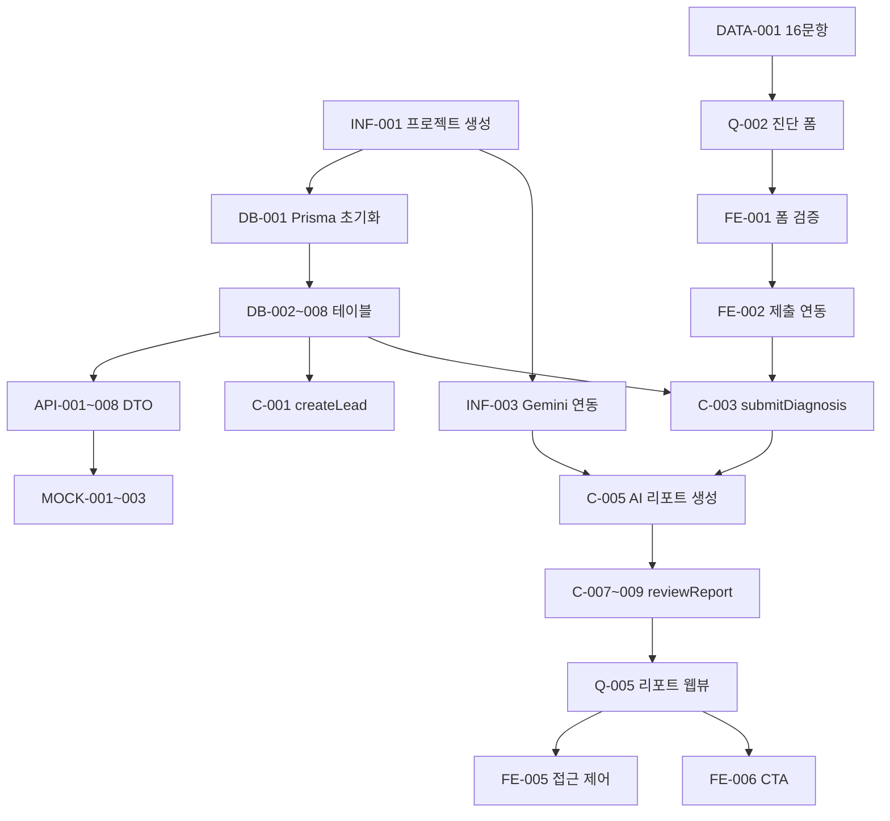

# 개발 태스크 목록 명세서

**Source:** SRS-001 v1.3 (5060 프리미엄 브랜드 매니지먼트 MVP-Free) + 보강 패치
**Date:** 2026-05-02
**Total Tasks:** 97

---

## Step 1. 계약·데이터 명세 Task (28건)

### 1-1. 데이터베이스 스키마 (11건)

| Task ID | Epic | Feature | 관련 SRS 섹션 | 선행 태스크 | 복잡도 |
|---|---|---|---|---|---|
| DB-001 | Infra/DB | Prisma 프로젝트 초기화 및 datasource 설정 (SQLite/PostgreSQL) | Appendix A, C-FREE-005 | None | L |
| DB-002 | Infra/DB | Lead 테이블 스키마·마이그레이션 (id, name, contact, channel, createdAt) | Appendix A, E | DB-001 | L |
| DB-003 | Infra/DB | Diagnosis 테이블 스키마·마이그레이션 (id, leadId FK, status, createdAt) | Appendix A, E | DB-001 | L |
| DB-004 | Infra/DB | Answer 테이블 스키마·마이그레이션 (id, diagnosisId FK, questionCode, answerText) | Appendix A, E | DB-003 | L |
| DB-005 | Infra/DB | Report 테이블 스키마·마이그레이션 (id, diagnosisId FK, status, reportJson, reviewNote) | Appendix A, E | DB-003 | L |
| DB-006 | Infra/DB | AiRun 테이블 스키마·마이그레이션 (id, diagnosisId FK, taskType, provider, status, errorMessage) | Appendix A, E | DB-003 | L |
| DB-007 | Infra/DB | ReviewLog 테이블 스키마·마이그레이션 (id, reportId FK, action, note, beforeJson, afterJson) | Appendix A, E | DB-005 | L |
| DB-008 | Infra/DB | AdminUser 테이블 스키마 (선택 — 환경변수 단순 인증 대체 가능) | Appendix A | DB-001 | L |
| DB-009 | Infra/DB | 주요 FK 및 status/createdAt 인덱스 추가 | Infra/DB | DB-001~008 | P0 |
| DB-010 | Infra/DB | seed 데이터 및 개발용 fixture 구성 | Infra/DB | DB-001~008 | P1 |
| DB-011 | Infra/DB | 개인정보 보존·삭제 기준 필드 검토 | Infra/DB | DB-002 | P1 |

### 1-2. API·통신 계약 DTO/Schema (10건)

| Task ID | Epic | Feature | 관련 SRS 섹션 | 선행 태스크 | 복잡도 |
|---|---|---|---|---|---|
| API-001 | Contract | createLead Server Action DTO 정의 (name, contact, channel → Lead) | 3.3 | DB-002 | L |
| API-002 | Contract | submitDiagnosis Server Action DTO 정의 (leadInfo + answers[] → Diagnosis + Answer[]) | 3.3 | DB-002, DB-003, DB-004 | M |
| API-003 | Contract | POST /api/ai/generate-report DTO 정의 (질문코드+답변 → DiagnosisReport JSON) | 3.3, Appendix B | DB-005 | M |
| API-004 | Contract | AI 진단 리포트 Zod Schema 작성 (DiagnosisReportSchema) | Appendix B | None | M |
| API-005 | Contract | reviewReport Server Action DTO 정의 (status변경+reviewNote → Report+ReviewLog) | 3.3 | DB-005, DB-007 | M |
| API-006 | Contract | regenerateReport Server Action DTO 정의 (재생성 요청 → AiRun+Report) | 3.3 | DB-005, DB-006 | L |
| API-007 | Contract | GET /api/reports/[id] Response DTO 정의 (approved Report만 반환) | 3.3 | DB-005 | L |
| API-008 | Contract | 공통 에러 응답 코드 정의 (400, 404, 500) | 3.3 | None | L |
| API-009 | Contract | 공통 ApiResponse 타입 정의 | Contract | INF-001 | P0 |
| API-010 | Contract | 공통 ValidationError 타입 정의 | Contract | API-009 | P0 |

### 1-3. 정적 데이터 및 Mock (7건)

| Task ID | Epic | Feature | 관련 SRS 섹션 | 선행 태스크 | 복잡도 |
|---|---|---|---|---|---|
| DATA-001 | Data | 16문항 질문 데이터 파일 작성 (lib/questions.ts — code, text, part, assetHint) | 4.1 F2-Lite, Appendix F | None | L |
| DATA-002 | Data | Diagnosis 상태값 enum 정의 (submitted, report_pending, report_generated, reviewed) | Appendix A | None | L |
| DATA-003 | Data | Report 상태값 enum 정의 (draft, approved, rejected, regeneration_requested) | Appendix A | None | L |
| DATA-004 | Data | AiRun 상태값 enum 정의 (pending, processing, completed, failed) | Appendix A | None | L |
| MOCK-001 | Mock | 16문항 진단 제출 성공/실패 Mock 데이터 | 4.1 F2-Lite | DATA-001 | L |
| MOCK-002 | Mock | AI 진단 리포트 성공 JSON Mock 데이터 (Zod 스키마 준수) | Appendix B | API-004 | L |
| MOCK-003 | Mock | 관리자 목록/상세 화면용 진단·리포트 Mock 데이터 | 4.1 F3-Lite | MOCK-001, MOCK-002 | L |

---

## Step 2. 로직·상태 변경 Task — CQRS 분해 (27건)

### 2-1. Read (Query) Task (9건)

| Task ID | Epic | Feature | 관련 SRS 섹션 | 선행 태스크 | 복잡도 |
|---|---|---|---|---|---|
| Q-001 | FE/Landing | 랜딩페이지 서비스 소개 및 진단 시작 CTA UI | S1 | None | L |
| Q-002 | FE/Diagnose | 16문항 진단 폼 UI — 질문 카드, assetHint, textarea | REQ-FREE-FUNC-001, 002 | DATA-001 | M |
| Q-003 | FE/Admin | 관리자 진단 목록 조회 UI (/admin) | REQ-FREE-FUNC-030 | DB-002, DB-003, DB-005 | M |
| Q-004 | FE/Admin | 관리자 진단 상세 조회 UI (/admin/diagnoses/[id]) | REQ-FREE-FUNC-031 | Q-003 | M |
| Q-005 | FE/Report | 승인 리포트 웹뷰 UI (/report/[id]) | REQ-FREE-FUNC-040, 041 | DB-005, API-007 | M |
| Q-006 | BE/Query | 관리자 진단 목록 조회 로직 (Prisma join, 최신순) | REQ-FREE-FUNC-030 | DB-002, DB-003 | L |
| Q-007 | BE/Query | 관리자 진단 상세 조회 로직 (Diagnosis+Answer+Report) | REQ-FREE-FUNC-031 | DB-003, DB-004, DB-005 | L |
| Q-008 | BE/Query | 승인 리포트 단건 조회 로직 (status=approved 필터) | REQ-FREE-FUNC-040, 034 | DB-005 | L |
| Q-009 | BE/Query | AiRun 로그 조회 로직 (진단별 AI 호출 이력) | S12 | DB-006 | L |

### 2-2. Write (Command) Task (11건)

| Task ID | Epic | Feature | 관련 SRS 섹션 | 선행 태스크 | 복잡도 |
|---|---|---|---|---|---|
| C-001 | BE/Command | createLead — 리드 정보 검증 및 Lead 저장 | REQ-FREE-FUNC-010, 003 | DB-002, API-001 | L |
| C-002 | BE/Command | submitDiagnosis — 16문항 답변 유효성 검증 (3단어 미만/공백 차단) | REQ-FREE-FUNC-004 | API-002 | M |
| C-003 | BE/Command | submitDiagnosis — Answer 16건 + Diagnosis 생성 및 DB 저장 | REQ-FREE-FUNC-011, 012 | C-001, C-002, DB-003, DB-004 | M |
| C-004 | BE/Command | AI 리포트 생성 요청 — payload 구성 (질문코드+답변만, 실명/연락처 제외) | REQ-FREE-FUNC-023 | C-003, API-003 | M |
| C-005 | BE/Command | AI 리포트 생성 — Gemini 호출 + Zod 검증 + Report(draft) 저장 | REQ-FREE-FUNC-020, 021 | C-004, API-004, DB-005 | H |
| C-006 | BE/Command | AI 리포트 생성 실패 처리 — AiRun 실패 기록 + 안내 메시지 | REQ-FREE-FUNC-022 | C-005, DB-006 | M |
| C-007 | BE/Command | reviewReport — 리포트 수정 저장 (reportJson 업데이트) | REQ-FREE-FUNC-032 | DB-005, API-005 | M |
| C-008 | BE/Command | reviewReport — 승인/거부 상태 변경 (approved/rejected) | REQ-FREE-FUNC-033 | C-007, DB-005 | M |
| C-009 | BE/Command | reviewReport — ReviewLog 생성 (action, note, beforeJson, afterJson) | REQ-FREE-FUNC-032, 033 | C-008, DB-007 | L |
| C-010 | BE/Command | regenerateReport — AI 리포트 재생성 (진단당 재생성 1회 제한) | 3.3, REQ-NF-FREE-023 | C-005, DB-006 | M |
| C-011 | BE/Command | CTA 클릭 이벤트 기록 (GA4 또는 DB 로그) | REQ-FREE-FUNC-042 | Q-005 | L |

### 2-3. 프론트엔드 인터랙션 Task (7건)

| Task ID | Epic | Feature | 관련 SRS 섹션 | 선행 태스크 | 복잡도 |
|---|---|---|---|---|---|
| FE-001 | FE/Diagnose | 진단 폼 클라이언트 유효성 검증 (이름, 연락처 1개+, 답변 3단어+) | REQ-FREE-FUNC-003, 004 | Q-002 | M |
| FE-002 | FE/Diagnose | 진단 폼 제출 → submitDiagnosis 연동 + 완료/검수 대기 안내 | 시퀀스 1 | FE-001, C-003 | M |
| FE-003 | FE/Admin | 관리자 리포트 수정 편집기 UI (reportJson 필드별) | REQ-FREE-FUNC-032 | Q-004 | M |
| FE-004 | FE/Admin | 관리자 승인/거부/재생성 버튼 → reviewReport/regenerateReport 연동 | REQ-FREE-FUNC-033 | FE-003, C-008, C-010 | M |
| FE-005 | FE/Report | 미승인 리포트 접근 시 404/"준비 중" 표시 | REQ-FREE-FUNC-034, 040 | Q-005, Q-008 | L |
| FE-006 | FE/Report | CTA 버튼 — 환경변수 기반 구글폼/이메일/카카오 링크 | REQ-FREE-FUNC-041 | Q-005 | L |
| FE-007 | FE/Admin | 관리자 인증 — 환경변수 패스워드 체크 (미들웨어/가드) | Prompt 4, OI-009 | None | M |

---

## Step 3. AI 비즈니스 분리 Task (2건)

| Task ID | Epic | Feature | 관련 SRS 섹션 | 선행 태스크 | 복잡도 |
|---|---|---|---|---|---|
| AI-001 | AI | AI 프롬프트 템플릿 파일 분리 | AI | API-004 | P0 |
| AI-002 | AI | AI 응답 파싱 실패 복구 로직 | AI | AI-001 | P1 |

---

## Step 4. 테스트 Task — AC → TDD 변환 (19건)

| Task ID | Epic | Feature | 관련 SRS 섹션 | 선행 태스크 | 복잡도 |
|---|---|---|---|---|---|
| T-001 | Test | 연락처 미입력 시 제출 차단 검증 | REQ-FREE-FUNC-003 AC | FE-001 | L |
| T-002 | Test | 답변 3단어 미만/공백 시 제출 차단 검증 | REQ-FREE-FUNC-004 AC | C-002 | L |
| T-003 | Test | createLead — Lead 레코드 정상 생성 검증 | REQ-FREE-FUNC-010 AC | C-001 | L |
| T-004 | Test | submitDiagnosis — Answer 16건 + Diagnosis.status 정상 저장 검증 | REQ-FREE-FUNC-011, 012 AC | C-003 | M |
| T-005 | Test | AI 리포트 JSON Zod 스키마 통과 검증 (sourceQuestionCodes 포함) | REQ-FREE-FUNC-020, 021 AC | C-005, API-004 | M |
| T-006 | Test | AI 리포트 실패 시 Answer 보존 + AiRun 실패 기록 검증 | REQ-FREE-FUNC-022 AC | C-006 | M |
| T-007 | Test | AI payload 실명/이메일/전화번호 미포함 검증 | REQ-FREE-FUNC-023, REQ-NF-FREE-030 AC | C-004 | L |
| T-008 | Test | 관리자 진단 목록 최신순 정렬 검증 | REQ-FREE-FUNC-030 AC | Q-006 | L |
| T-009 | Test | 관리자 수정 — reportJson 업데이트 정상 저장 검증 | REQ-FREE-FUNC-032 AC | C-007 | L |
| T-010 | Test | 관리자 승인/거부 — status 변경 + ReviewLog 생성 검증 | REQ-FREE-FUNC-033 AC | C-008, C-009 | M |
| T-011 | Test | draft/rejected 리포트 접근 차단 (404/"준비 중") 검증 | REQ-FREE-FUNC-034, 040 AC | FE-005, Q-008 | M |
| T-012 | Test | approved 리포트만 정상 표시 검증 | REQ-FREE-FUNC-040 AC | Q-008 | L |
| T-013 | Test | CTA 클릭 이벤트 기록 검증 | REQ-FREE-FUNC-042 AC | C-011 | L |
| T-014 | Test | AI 호출 횟수 제한 — 진단당 1회+재생성 1회 초과 차단 검증 | REQ-NF-FREE-023 | C-010 | M |
| T-015 | Test | 관리자 인증 — 잘못된 패스워드 접근 차단 검증 | OI-009 | FE-007 | L |
| T-017 | Test | AI 응답 Zod 실패 테스트 | Test | C-005 | P0 |
| T-018 | Test | 관리자 승인 후 외부 리포트 접근 가능 테스트 | Test | SEC-003, Q-008 | P1 |
| T-019 | Test | 관리자 미인증 접근 차단 E2E 테스트 | Test | SEC-002 | P1 |
| T-020 | Test | 개인정보 마스킹 snapshot 테스트 | Test | SEC-001 | P0 |

---

## Step 5. 비기능·인프라 Task (21건)

### 5-1. 인프라·보안·성능·로깅 (15건)

| Task ID | Epic | Feature | 관련 SRS 섹션 | 선행 태스크 | 복잡도 |
|---|---|---|---|---|---|
| INF-001 | Infra | Next.js App Router 프로젝트 생성 + Tailwind + shadcn/ui | Appendix C Step 1~2 | None | L |
| INF-002 | Infra | Supabase Free 프로젝트 생성 + Prisma 연결 | Appendix C Step 3 | INF-001, DB-001 | M |
| INF-003 | Infra | Gemini API Free Tier + Vercel AI SDK 연동 | 3.1, C-FREE-006 | INF-001 | M |
| INF-004 | Infra | Vercel Hobby 배포 설정 (Git 연동, 환경변수) | 3.1, C-FREE-004 | INF-001, INF-002 | M |
| INF-005 | Infra | 환경변수 구성 (DATABASE_URL, GEMINI_API_KEY, ADMIN_PASSWORD, CTA_LINK) | 전체 | INF-001 | L |
| SEC-001 | Security | AI payload 익명화 파이프라인 (실명/연락처 제거) | REQ-NF-FREE-030, 031 | C-004 | M |
| SEC-002 | Security | 관리자 인증 미들웨어 (환경변수 패스워드+세션) | OI-009 | FE-007 | M |
| SEC-003 | Security | 미승인 리포트 외부 URL 접근 차단 | REQ-NF-FREE-033 | Q-008 | L |
| PERF-001 | Performance | 랜딩페이지 3초 이내 표시 검증 | REQ-NF-FREE-001 | Q-001 | L |
| PERF-002 | Performance | 진단 제출 후 DB 저장 5초 이내 검증 | REQ-NF-FREE-002 | C-003 | L |
| PERF-003 | Performance | AI 리포트 60초 초과 시 "처리 중" 안내 UI | REQ-NF-FREE-003 | C-005 | M |
| LOG-001 | Logging | AiRun 기반 AI 호출 로깅 (성공/실패/시간/오류) | S12 | DB-006, C-005 | L |
| LOG-002 | Logging | Sentry Free 또는 Vercel Logs 연동 (선택) | 3.1 | INF-004 | L |
| OPS-003 | Ops | 배포 전 환경변수 체크리스트 | Ops | INF-005 | P0 |
| OPS-004 | Ops | 수동 장애 복구 Runbook 작성 | Ops | LOG-001, LOG-002 | P1 |

### 5-2. 데이터 보호·운영 (6건)

| Task ID | Epic | Feature | 관련 SRS 섹션 | 선행 태스크 | 복잡도 |
|---|---|---|---|---|---|
| DPR-001 | DataProtection | 고객 동의 체크박스 UI (개인정보 수집·AI 처리 동의) | REQ-NF-FREE-031, OI-007 | Q-002 | L |
| DPR-002 | DataProtection | 무료 AI API 데이터 처리 약관 검토 체크리스트 | REQ-NF-FREE-032 | None | L |
| OPS-001 | Ops | 장애 수동 확인·복구 체크리스트 문서화 | REQ-NF-FREE-011 | INF-004 | L |
| OPS-002 | Ops | GA4 기본 방문/CTA 이벤트 추적 설정 (선택) | 3.1 | INF-004 | L |
| DPR-003 | DataProtection | 개인정보 처리 안내 문구 작성 | Compliance | DB-011 | P0 |
| DPR-004 | DataProtection | AI 분석 동의 문구 작성 | Compliance | DPR-002 | P0 |

---

## 의존성 맵 (Critical Path)

---

## 보강 후 권장 Milestone 구조 (총 97개 태스크)

### Milestone 0. 프로젝트 기반 구축
- **포함 태스크:** INF-001, DB-001, INF-002, INF-005, DB-009, API-009, API-010
- **완료 기준:** Next.js 프로젝트 실행 가능, Prisma 연결 가능, 환경변수 템플릿 완성, 공통 응답 타입 정의 완료

### Milestone 1. 데이터 계약 및 스키마 확정
- **포함 태스크:** DB-002~008, DATA-001~004, API-001~008, DB-010, DB-011
- **완료 기준:** 모든 Prisma model 작성, enum 정의 완료, Zod schema 작성, seed 데이터 생성 가능

### Milestone 2. 진단 제출 기능 구현
- **포함 태스크:** Q-001, Q-002, FE-001, DPR-001, DPR-003, DPR-004, C-001~003, FE-002, T-001~004
- **완료 기준:** 사용자가 진단 폼 제출 가능, Lead/Diagnosis/Answer 정상 저장, 답변 검증 및 rollback 테스트 통과

### Milestone 3. AI 리포트 생성 기능 구현
- **포함 태스크:** INF-003, AI-001, AI-002, SEC-001, C-004~006, LOG-001, T-005~007, T-017, T-020
- **완료 기준:** Gemini 호출 가능, AI payload 개인정보 미포함, Report draft 저장 가능, 실패 로그 저장 가능

### Milestone 4. 관리자 검수 콘솔 구현
- **포함 태스크:** FE-007, SEC-002, SEC-004, Q-003~004, Q-006~007, FE-003~004, C-007~010, T-008~010, T-014~016, T-019
- **완료 기준:** 관리자 로그인 가능, 진단 목록/상세 조회 가능, 리포트 승인·거부·수정·재생성 가능

### Milestone 5. 승인 리포트 웹뷰 및 CTA 구현
- **포함 태스크:** Q-008, SEC-003, Q-005, FE-005~006, C-011, T-011~013, T-018
- **완료 기준:** approved 리포트 외부 노출, 접근 차단 기능 정상 동작, CTA 링크 작동 및 이벤트 기록

### Milestone 6. 배포·운영 안정화
- **포함 태스크:** INF-004, PERF-001~003, LOG-002, OPS-001~004, DPR-002
- **완료 기준:** Vercel 배포 완료, 성능 기준 검증 완료, 환경변수 및 장애 복구 메뉴얼 확인

---

## 태스크 통계 (수정본)

| 카테고리 | 기존 건수 | 보강 건수 | 누적 총계 |
|---|---|---|---|
| Step 1: DB/Data/API | 23 | +5 | 28 |
| Step 2: Query/Command/FE | 27 | 0 | 27 |
| Step 3: AI 비즈니스 분리 | 0 | +2 | 2 |
| Step 4: 테스트 | 15 | +4 | 19 |
| Step 5: 인프라/운영/보안 | 17 | +4 | 21 |
| **합계** | **82** | **+15** | **97** |

> **Note:** 본 목록은 보강 패치가 반영된 최종 MVP-Free 범위입니다.
